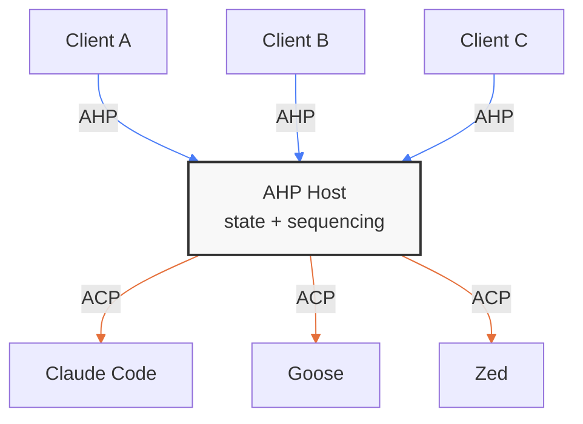

# AHP 和代理用戶端協定

[代理用戶端協定 (ACP)](https://github.com/agentclientprotocol/agent-client-protocol) 定義單一用戶端如何與單一 AI 編碼代理程式對話 — 初始化、驗證、提示、串流更新、工具呼叫和權限。它是一個點對點協定。

代理主機協定 (AHP) 解決了另一個問題：**在共用代理程式工作階段上協調 N 用戶端**。 AHP 主機管理權威的狀態，將其同步到每個連線的用戶端，並透過純 reducer對所有突變進行排序。主機本身需要與代理程式通訊－這就是 ACP 的用武之地。

**AHP 是協調層。 ACP 是通訊層。他們自然地創作。 **

## 分層

在主機之上，AHP 處理多個用戶端問題：狀態同步、預先寫入協調、訂閱管理和作業排序。在主機下方，ACP（或任何特定於代理的介面）處理與代理的 1:1 對話 - 提示回合、串流內容區塊、工具執行和權限流。

主機是這兩個問題之間的邊界。

## 每個協定擁有什麼

|關注| AHP | ACP |
|---|---|---|
| **多用戶端協調** |核心目的 — N 用戶端參見同步狀態 |未解決 - 假設單一用戶端 |
| **狀態權限** | Host持有權威的狀態樹；用戶端協調 |代理持有工作階段狀態；用戶端收到更新 |
| **動作排序** |具有 `serverSeq` 排序的伺服器序列動作信封 |帶有流通知的請求-回應 |
| **重新連線/重播** |內建 — 用戶端與 `lastSeenServerSeq` 重新連線並重播錯過的動作 |未在協定層級指定 |
| **代理抽象** |設計上與代理無關 - 用戶端永遠不會看到特定於代理的詳細資訊 |特定於代理—直接定義代理的介面 |
| **工作階段生命週期** |主機管理工作階段；用戶端透過 URI 訂閱 | 用戶端直接使用代理程式建立工作階段 || **串流媒體** |透過reducer應用的操作 (`chat/delta`, `chat/responsePart`) | `session/update` 透過線路發送的通知 |

## 他們如何創作

AHP 主機實作可以使用 ACP 作為其代理後端協定。內部流程如下圖所示：

1. **用戶端透過 AHP 調度操作**（例如 `chat/turnStarted`）。
2. **主機對其進行排序** — 分配一個 `serverSeq`，將其應用於權威的狀態，將操作信封廣播到所有訂閱的用戶端。
3. **主機轉換為 ACP** — 將 `session/prompt` 傳送到 ACP 代理程式。
4. **代理回傳** — ACP 代理程式發送包含內容區塊、工具呼叫和權限請求的 `session/update` 通知。
5. **主機映射到 AHP 操作** — 代理事件映射器將特定於 ACP 的事件轉換為與代理無關的 AHP 操作（`chat/delta`、`chat/toolCallStart`、`chat/toolCallReady` 等）。
6. **主機廣播** — 每個映射的操作都會獲得一個 `serverSeq` 並透過正常的狀態同步路徑流向所有訂閱的用戶端。

主機充當橋樑：它與上游 AHP（至用戶端）和下游（至代理）ACP 進行通訊。代理事件映射器是兩者之間的轉換層。

## 互斥體類比

一個有用的心理模型：**AHP 是 ACP 上的互斥鎖。 **

當多個用戶端連線到同一代理工作階段時，主機會序列化它們的交互作用。 ACP 定義了 1:1 對話 — 一個提示、一個回應、一個權限流程。 AHP 將 1:1 對話包裝在協調機制中，以便 N 用戶端可以觀察和參與，而不會互相踩踏。

具體來說：

- **回合所有權**：每次聊天一次只運行一個回合。當用戶端 A 開始聊天時，用戶端 B 和 C 會看到 `chat/turnStarted` 操作並知道聊天正忙。 AHP 的狀態樹使其對所有人都可見。
- **工具呼叫確認**：當代理程式需要使用者批准工具呼叫時，主機會將其顯示為狀態操作。任何用戶端都可以解決它 - 但只能解決一次（第一個 `chat/toolCallConfirmed` 獲勝；後續的 `chat/toolCallConfirmed` 被拒絕）。主持人仲裁。
- **取消**：任何用戶端都可以取消正在執行的回合。主機對 `chat/turnCancelled` 操作進行排序，並透過 ACP 的 `session/cancel` 將取消轉送給代理程式。所有用戶端都會看到結果。
- **樂觀更新與協調**：用戶端立即套用自己的動作（預寫），並在伺服器回顯時進行協調。這提供了響應式 UI，而不犧牲一致性——這是 1:1 協定不需要擔心的。

ACP 不需要任何這些，因為它假定一個用戶端。 AHP 正是新增了這種協調，僅此而已 - 它不會重新定義代理的工作方式、它們公開的工具或它們如何傳輸內容。

## AHP 不做什麼

AHP 故意不參與：

- **代理實作** — AHP 不定義代理程式如何處理提示、呼叫工具或管理上下文視窗。這是代理關心的問題（以及 ACP 的域）。
- **模型路由** — 主機將可用的代理程式和模型發佈到根狀態，但實際的 LLM 呼叫發生在代理後端內部。
- **工具定義** — AHP 沒有工具登錄或工具架構。工具是代理內部的。主機僅在代理事件映射器處理元資料後才能看到可顯示的元資料。
- **代理間通訊** — AHP 座標用戶端，而非代理。如果代理需要相互交談，那就是另一個問題了。

## 何時使用哪一個

**當您建立需要與用戶端（編輯器、CLI、Web 應用程式）對話的代理程式時，請使用 ACP**。 ACP 為您提供工作階段管理、提示/回應週期、串流、工具呼叫和權限 - 單一用戶端驅動單一代理程式所需的一切。

**當您需要多個用戶端共用同一個代理程式工作階段時，請使用 AHP**。 AHP 為您提供狀態同步、操作排序、預寫入協調和訂閱管理 - 在共享狀態上協調 N 用戶端所需的一切。

**當您建置將多個用戶端橋接到多個代理程式的主機時，請同時使用兩者。主機與其用戶端通話 AHP，對其代理通話 ACP。這是 AHP 參考實作的目標架構：一個獨立的伺服器（或 Electron 實用程式行程），用於管理工作階段、同步狀態並將代理工作委託給與 ACP 相容的後端。