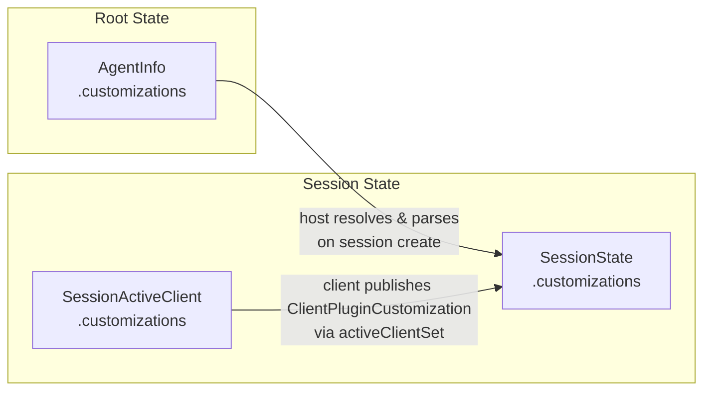
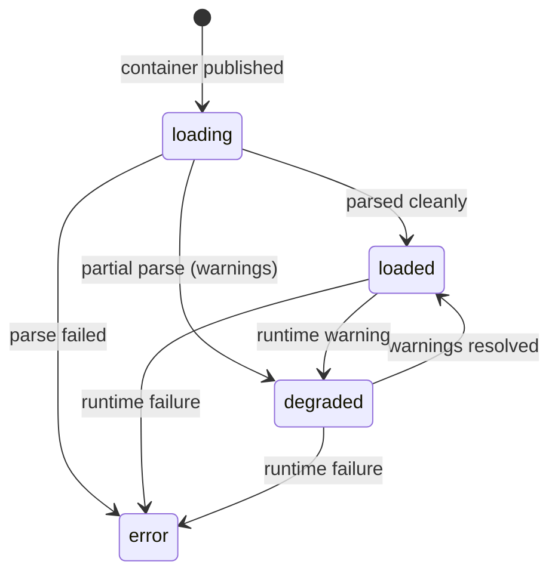
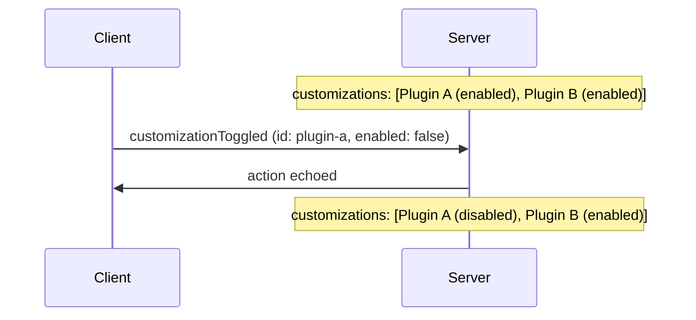
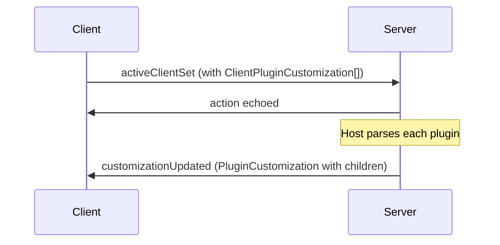
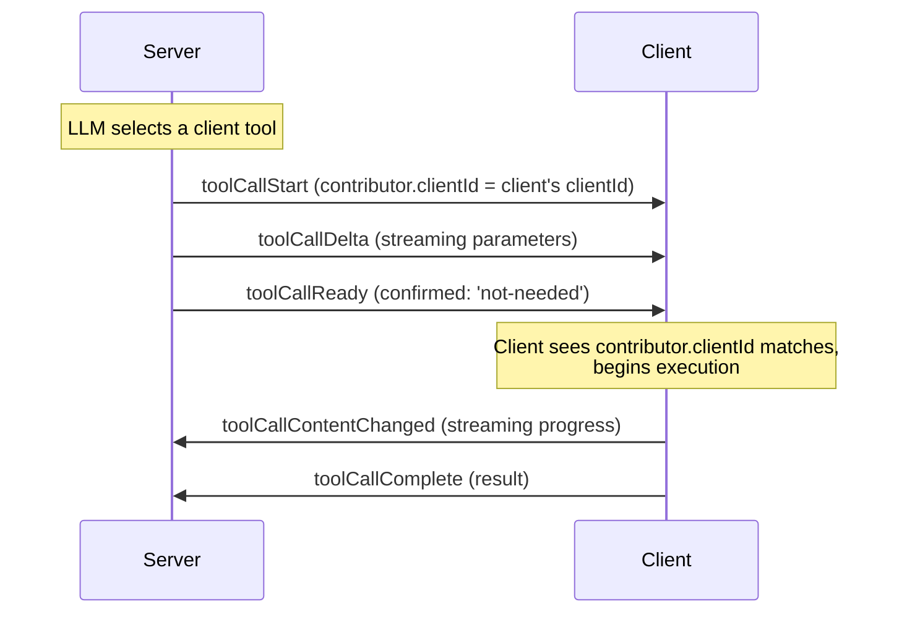
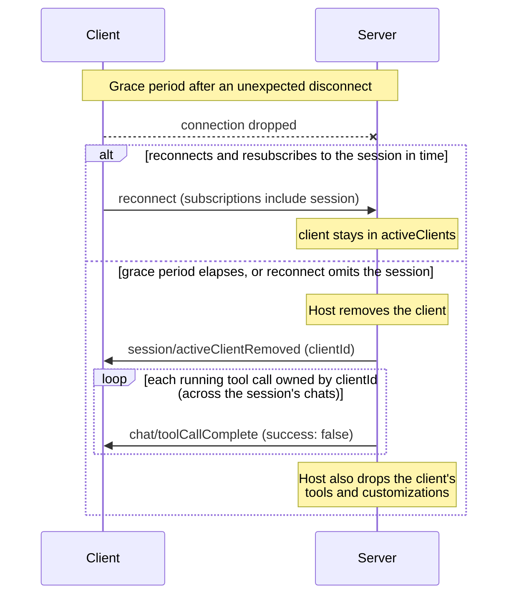
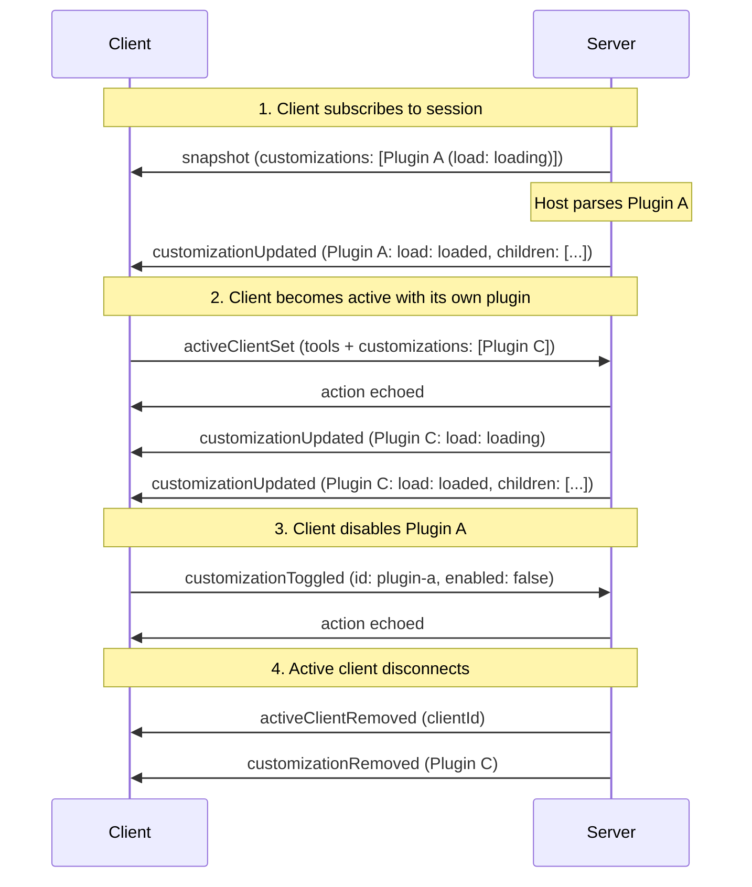

# 自訂

自訂擴展了代理工作階段的附加功能 - 代理、技能、提示、規則、掛鉤和 MCP 伺服器。 AHP 將它們組織為具有固定類型集和淺樹的判別聯集：

- **頂層條目通常是容器**：`PluginCustomization`（[開放插件](https://open-plugins.com/) 套件）或 `DirectoryCustomization`（主機在磁碟上監視的目錄）。主機也可以在頂層顯示一個裸露的 `McpServerCustomization`（例如，未捆綁在插件中的全域配置的 MCP 伺服器）。
- **其他子節點住在容器內**：`AgentCustomization`，`SkillCustomization`，`PromptCustomization`，`RuleCustomization`，`HookCustomization`，`McpServerCustomization`。因此，MCP 伺服器可以出現在任一位置。

代理主機在有效樹上具有權威。用戶端發布插件，主機將它們擴展為子插件，主機擁有磁碟支援的目錄和裸露的頂級 MCP 伺服器。

有關 MCP 特定的行為（伺服器生命週期、驗證、應用支援），請參閱 [MCP 伺服器](/guide/mcp)。

## 來源

自訂從兩個位置輸入工作階段：

1. **伺服器-provided** — 代理主機透過 `AgentInfo.customizations` 宣告每個代理程式上的容器。建立工作階段時，主機解析容器，解析其內容，並在 `SessionState.customizations` 中公開結果。
2. **用戶端-provided** — 活動的用戶端透過 `SessionActiveClient.customizations` 貢獻 `ClientPluginCustomization` 條目（帶有可選 `nonce` 的 `PluginCustomization`）。主機可以解析已發佈的插件並將其（及其子插件）顯示在工作階段的頂級清單中。





用戶端僅以開放插件形式發布。如果他們的真實來源在磁碟上，他們可以在記憶體中合成一個虛擬插件；將工作空間位置對應到實體目錄是主機的工作，而不是用戶端的工作。

## 身份

每個自訂都帶有一個 `id` 和一個 `uri`。它們是不同的概念：

- **`id`** 是一個工作階段-唯一的不透明令牌。它標識每個自訂操作的入口 - 切換、更新和刪除。它是由發布定制的人（通常是主機）鑄造的。
- **`uri`** 是描述性來源 URI。對於插件，它是套件 URL，對於目錄，它是目錄路徑，對於檔案支援的子項，它是檔案 URI。對於內聯聲明（例如，在 `plugins.json` 清單內聲明的 MCP 伺服器）`uri` 指向包含文件，並且可選的 **`range`** 將其縮小到該文件內的聲明範圍。

使用 `id` 進行協定操作。使用 `uri` 進行持久引用（例如 `AgentSelection.uri`，它必須在工作階段中生存）。

## 提供者元資料

每個自訂（容器或子容器）還附帶一個可選的 `_meta` 物件：一個反映 MCP `_meta` 約定的特定於提供者的逃生艙口。它對協定來說是不透明的，因此最小的用戶端可以完全忽略它；居住在其中的生產者和消費者在帶外就其內容達成一致。只要資料具有自然類型的歸屬（例如代理的 `model`），就首選第一類欄位，並為沒有專用 AHP 欄位的真正提供者特定的資料保留 `_meta`。

## 容器

容器自訂攜帶主機報告的 `load` 狀態和 `children` 陣列。


```typescript
PluginCustomization {
  type: 'plugin'
  id: string                     // session-unique handle
  uri: URI                       // plugin URL or marketplace id
  name: string
  icons?: Icon[]
  enabled: boolean
  clientId?: string              // set when published by a client
  load?: CustomizationLoadState  // host-reported parse/load state
  children?: ChildCustomization[]
}

DirectoryCustomization {
  type: 'directory'
  id: string
  uri: URI                       // directory URI
  name: string
  icons?: Icon[]
  enabled: boolean
  clientId?: string
  load?: CustomizationLoadState
  children?: ChildCustomization[]
  contents: ChildCustomizationType  // which child kind lives here
  writable: boolean                 // clients may write into it (via resourceWrite)
}
```


當主機尚未解析容器時，`children` 是**不存在**；當主機解析容器但沒有發現任何內容時，`children` 是**空**。

### 載入狀態

`load` 是判別聯集：





|親切 |意義|
|---|---|
| `loading` |主機正在載入/解析容器（初始狀態）|
| `loaded` |主機已完全解析容器|
| `degraded` |貨櫃部分裝載； `message` 描述警告 |
| `error` | 貨櫃裝載失敗；`message` 帶有錯誤 |

## 子節點

每個子節點都帶有相同的基本欄位（`id`、`uri`、`name`、可選的 `icons`）以及一個 `enabled` 標誌 - 對於五個葉子子節點來說是可選的（缺席意味著啟用）並且始終出現在 `McpServerCustomization` 上。子節點是葉節點——沒有進一步的巢狀——並且它們的父節點由哪個容器將它們儲存在其 `children` 陣列中來暗示。子級的 `enabled` 與其容器無關。子項沒有 `clientId`：用戶端出處存在於容器上，因為用戶端只能貢獻容器，而無法貢獻單一子項。

每個子型別都攜帶來自其 [開放插件](https://open-plugins.com/plugin-builders/specification.md) 元件定義的可選元資料（通常是檔案的 YAML frontmatter）：


```typescript
AgentCustomization        { type: 'agent';       description?, model?, tools?, disableModelInvocation?, disableUserInvocation? }
SkillCustomization        { type: 'skill';       description?, disableModelInvocation?, disableUserInvocation? }
PromptCustomization       { type: 'prompt';      description? }
RuleCustomization         { type: 'rule';        description?, alwaysApply?, globs? }    // covers "instruction" formats too
HookCustomization         { type: 'hook';        event?, matcher? }
McpServerCustomization    { type: 'mcpServer';   enabled, state, channel?, mcpApp? }   // see /guide/mcp
```


代理和技能帶有對稱的呼叫矩陣。 `disableModelInvocation` 從代理的自動選擇中刪除該條目（它不會自動委託的自訂代理，或它不會自動呼叫的技能），同時保留它供使用者選擇。 `disableUserInvocation` 則相反：該​​條目仍然可供代理呼叫，但對面向使用者的選擇器和斜線命令隱藏。預設情況下，兩者都不存在/`false`（可由任何一方呼叫），且它們是獨立的，因此條目可以僅代理、僅使用者、兩者或兩者都不是。

協定有意省略主機內部執行細節（鉤子的指令/腳本、MCP 伺服器的 `command`/`args`/`env` 等）。那些留在代理主機上；用戶端僅查看顯示、搜尋和選擇所需的內容。一旦伺服器運行，MCP 工具及其描述就會透過標準工具管道出現。 MCP 特定的執行時間欄位（`state`、`channel`、`mcpApp`）包含在 [MCP 伺服器](/guide/mcp) 中。

消費者按 `type` 進行過濾以查找他們關心的子項 - 例如，代理選擇器讀取任何容器下的每個 `AgentCustomization`：


```typescript
state.customizations
  ?.flatMap(c => c.children ?? [])
  .filter(c => c.type === CustomizationType.Agent)
```


## 切換

任何用戶端都可以透過使用該條目的 `id` 分派 `session/customizationToggled` 來啟用或停用任何自訂：


```typescript
{
  type: 'session/customizationToggled'
  id: string         // any customization id
  enabled: boolean
}
```


容器和子容器都帶有 `enabled` 標誌。 reducer 首先將 `id` 與每個頂級自訂（外掛程式、目錄和裸頂 MCP 伺服器）相匹配，然後與每個容器內的子項進行匹配，並設定該條目的 `enabled`。子級的有效狀態為 `container.enabled && (child.enabled ?? true)`，因此禁用容器會停用其所有子級，無論每個子級自己的標誌為何，且子級切換僅在其容器啟用時生效。如果沒有自訂具有該 ID，則該操作是無操作。





## 伺服器-側面更新

主機透過兩個操作報告容器更改：

- **`session/customizationsChanged`** — 完全替換頂層清單。當整個有效集發生變化時使用。
- **`session/customizationUpdated`** — 按 `customization.id` 更新插入一個頂層容器。如果找到，則該條目將被完全替換（包括其 `children` 陣列）；如果沒有，則將其附加。

子項總是作為其容器的一部分進行更新。為了反映每個子項的變更（例如，完成解析的單一技能），主機使用相同的容器和更新的 `children` 陣列重新分派 `customizationUpdated`。沒有欄位級合併，也沒有針對每個子項的操作。

對於搬遷：

- **`session/customizationRemoved { id }`** — 按 id 刪除自訂。如果該條目是頂級容器，則其子項將隨之刪除。如果條目是子項，則僅刪除該子項。如果沒有找到符合的 id，則不執行任何操作。

## 儲存新的自訂設定

當用戶端想要保留新的自訂（例如編寫新的技能文件）時，它會以 `writable: true` 為目標 `DirectoryCustomization` 並使用 [`resourceWrite`](/reference/common#resourcewrite) 寫入其中。主機監視目錄並透過為目錄重新分派 `session/customizationUpdated`（攜帶更新的 `children` 陣列）來顯示產生的子目錄。

協定沒有定義專用的儲存操作 - 目錄加上 `resourceWrite` 就足夠了。

## 用戶端-已發佈的插件

用戶端以活動的用戶端加入工作階段並透過 `session/activeClientSet` 貢獻插件。一個工作階段可能同時有多個活動的用戶端；條目由 `clientId` 鍵入。用戶端自訂是 `ClientPluginCustomization` 值 - `PluginCustomization` 和可選的 `nonce`，主機可以使用它來偵測發佈之間的變更。


```typescript
dispatch({
  type: 'session/activeClientSet',
  activeClient: {
    clientId: 'my-client-id',
    displayName: 'VS Code',
    tools: [ /* ... */ ],
    customizations: [
      {
        type: 'plugin',
        id: 'client-plugin-1',
        uri: 'virtual://my-client/workspace-skills',
        name: 'Workspace Skills',
        enabled: true,
        nonce: 'sha256:...',
      },
    ],
  },
});
```


主機解析插件並將其顯示在 `SessionState.customizations` 中，並設定了 `clientId` 並填充了 `children`。當活動的用戶端斷開連線（或透過 `session/activeClientRemoved` 刪除）時，主機應該從工作階段清單中刪除其自訂。





## 用戶端-提供的工具

AHP 工作階段可以公開來自兩個來源的工具：代理主機提供的 **伺服器工具**，以及活動用戶端（例如 IDE）提供的 **用戶端工具**。用戶端工具允許代理呼叫只有用戶端有權存取的功能。

設計重點：

- **用戶端工具是狀態，而不是 RPC。 ** 它們位於 `SessionState.activeClients[].tools` 中，並且對所有訂閱者可見。
- **工具執行與伺服器工具遵循相同的狀態機器** - 唯一的區別是_誰_執行：對於用戶端工具，擁有者用戶端執行。
- **伺服器透過在 `chat/toolCallStart` 上設定工具呼叫的用戶端 `contributor`（具有所屬的 `clientId`）來辨識用戶端工具呼叫**。

### 註冊工具

用戶端透過將其工具包含在 `session/activeClientSet` 負載中來註冊其工具（與註冊自訂項目的操作相同）：


```typescript
// Client joins as an active client with tools and customizations
dispatch({
  type: 'session/activeClientSet',
  activeClient: {
    clientId: 'my-client-id',
    displayName: 'VS Code',
    tools: [
      {
        name: 'runUnitTests',
        title: 'Run Unit Tests',
        description: 'Runs unit tests in the project',
        inputSchema: {
          type: 'object',
          properties: { pattern: { type: 'string' } }
        },
      },
    ],
    customizations: [ /* ... */ ],
  },
});
```


註冊後，reducer 將工具儲存在 `state.activeClients` 中的符合項目上（由 `clientId` 鍵入）。

### 更新工具

若要變更其工具列表，用戶端會重新分派 `session/activeClientSet` 及其完整的、更新的 `SessionActiveClient` 條目。 upsert（由 `clientId` 鍵控）取代了先前的條目 - 工具和所有內容：


```typescript
dispatch({
  type: 'session/activeClientSet',
  activeClient: {
    clientId: 'my-client-id',
    displayName: 'VS Code',
    tools: updatedToolList, // full replacement
    customizations: [ /* unchanged — host may skip re-parsing via nonce */ ],
  },
});
```


沒有單獨的僅限工具的操作：因為每個 `activeClients` 條目都有一個擁有者，因此重新發布整個條目是更新其 `tools` 或 `customizations` 的規範方法。主機可以使用每個 `ClientPluginCustomization` 的 `nonce` 來偵測未更改的自訂並跳過重新解析。

### 工具名稱唯一性

伺服器工具和用戶端工具共用平面命名空間 (`ToolDefinition.name`)。代理主機實作應該確保兩個集合中的名稱是唯一的 - 例如透過新增前綴用戶端工具名稱。

### 執行用戶端工具呼叫

當 LLM 呼叫用戶端提供的工具時，會發生下列序列：





1. **`chat/toolCallStart`** — 伺服器將工具呼叫的 `contributor` 分派給用戶端貢獻者，其 `clientId` 是擁有者用戶端。這告訴用戶端它擁有該工具呼叫。

2. **`chat/toolCallDelta`**（零個或多個）— 伺服器在 LLM 產生部分參數時串流它們。用戶端可以觀察工具呼叫狀態上的 `partialInput` 以預覽參數。

3. **`chat/toolCallReady`** — 參數齊全。對於用戶端提供的工具，伺服器通常會設定 `confirmed: 'not-needed'`，以便工具直接轉換到 `running`。如果伺服器需要使用者先確認，則它會省略 `confirmed` 並套用標準確認流程。

4. **用戶端執行** — 當工具呼叫達到 `running` 狀態時，所屬的用戶端開始使用工具呼叫狀態中的 `toolInput` 執行。

5. **`chat/toolCallContentChanged`**（零個或多個，用戶端-調度）—執行時，用戶端可以透過調度此操作來傳輸中間內容（例如終端機輸出、部分結果）。這將取代運行工具呼叫狀態上的 `content` 陣列。

6. **`chat/toolCallComplete`** (用戶端-dispatched) — 用戶端將其與執行結果一起調度。如果調度用戶端與工具呼叫的 `contributor.clientId` 不匹配，則伺服器應拒絕此操作。

### 拒絕無法辨識的工具

如果用戶端收到對其無法識別的工具的工具呼叫（例如，在過時的註冊之後），它必須使用 `approved: false` 分派 `chat/toolCallConfirmed`：


```typescript
dispatch({
  type: 'chat/toolCallConfirmed',
  channel: chatUri,
  turnId,
  toolCallId,
  approved: false,
  reason: 'denied',
});
```


### 活動-用戶端生命週期

活躍會員資格是**工作階段範圍**並由主機管理：

- **加入。 ** 用戶端將其自身與 `session/activeClientSet` 新增（一個 upsert 鍵控
  由`clientId`）。多個用戶端可能同時處於活動狀態。用戶端永遠不需要
  「取消設定」本身——它只是停止刷新並讓主機將其刪除。
- **離開。 ** 主機刪除帶有 `session/activeClientRemoved` 的用戶端（透過
  `clientId`）。主機應該在以下情況下執行此操作：
  1. 用戶端 **取消訂閱** 工作階段通道；
  2. 用戶端 **斷開連線**且不在主機定義的範圍內重新連線
     寬限期；或
  3. 用戶端 **重新連線但不重新訂閱** 工作階段
     仍然有效 - 即 `reconnect` 指令的 `subscriptions` 省略
     工作階段 URI。

寬限期持續時間和具體策略由主機定義；僅協定
定義 `session/activeClientSet` / `session/activeClientRemoved` 操作
用來表達結果。

### 取消已刪除的用戶端的工具呼叫

當主機刪除一個活動的用戶端時，它也應該取消該用戶端的
運行中的工具呼叫，這樣它們就不會無限期地停留在 `running` 中。一個
用戶端工具呼叫的狀態帶有用戶端 `ToolCallContributor`
匹配的`clientId`；這些可能分散在多個聊天中
工作階段。對於每個此類呼叫，主機都會調度 `chat/toolCallComplete`
`result.success = false` 和解釋性訊息。

::: 小費
這裡的「取消」是**失敗的完成**：呼叫以`completed`結束
狀態為 `result.success = false`，而非 `cancelled` 狀態。沒有
每個工具呼叫伺服器啟動的取消操作 — `cancelled` 狀態被保留
對於使用者驅動的拒絕/跳過/結果拒絕的確認流程（以及
Whole-turn `chat/turnCancelled`，強制取消每個正在進行的呼叫
輪到，無論所有者是誰）。
:::





## 行動總結

| 型別 | 用戶端-可調度？ |當 |
|---|---|---|
| `session/customizationsChanged`|沒有 | 伺服器取代了頂級自訂清單（完全替換） |
| `session/customizationToggled` | **是** | 用戶端按 ID 開啟或關閉自訂 |
| `session/customizationUpdated` |沒有 | 伺服器按 id 更新插入頂級容器（完整條目替換，包括子項）|
| `session/customizationRemoved` |沒有 | 伺服器按 id 刪除自訂（容器級聯）|
| `session/activeClientSet` | **是** | 用戶端加入或刷新作為活動的用戶端（使用工具 + 自訂），由 `clientId` | 鍵控
| `session/activeClientRemoved` | **是** | 用戶端離開活動集（由 `clientId`）|
| `chat/toolCallStart` |沒有 | 伺服器開始工具呼叫（為用戶端工具設定用戶端 `contributor`）|
| `chat/toolCallComplete`| **是** | 用戶端完成執行工具呼叫 |
| `chat/toolCallContentChanged` | **是** | 用戶端流中間工具輸出 |

## 完整的工作階段流程





## 後續步驟

- [狀態模型](/guide/state-model) — 自訂項目和工具所在的狀態樹，包括工具呼叫生命週期狀態機器。
- [Actions](/guide/actions) — 狀態如何透過運算進行變異。
- [工作階段通道參考](/reference/session) — `SessionActiveClient`、`ToolDefinition`、`ToolCallState`、`Customization`、`ChildCustomization` 等。