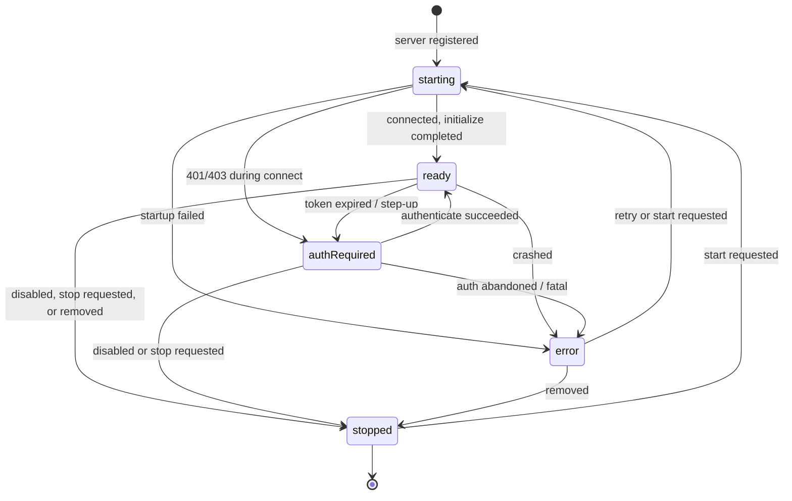
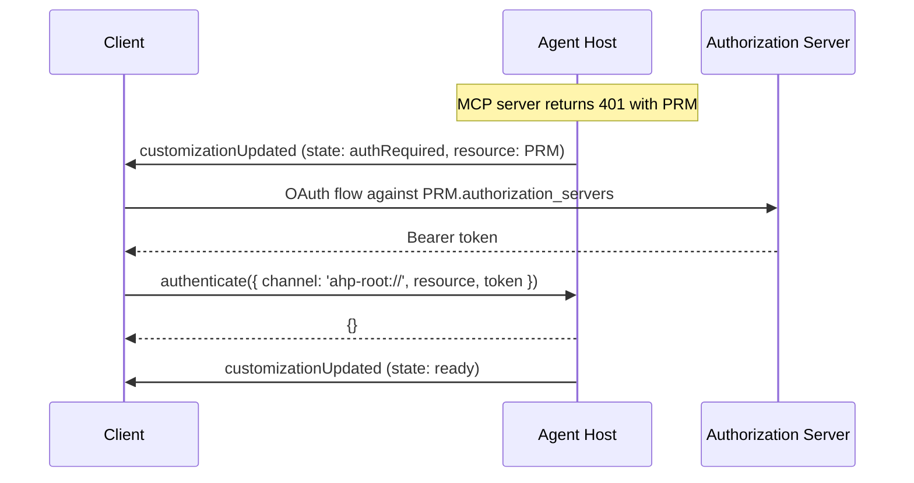
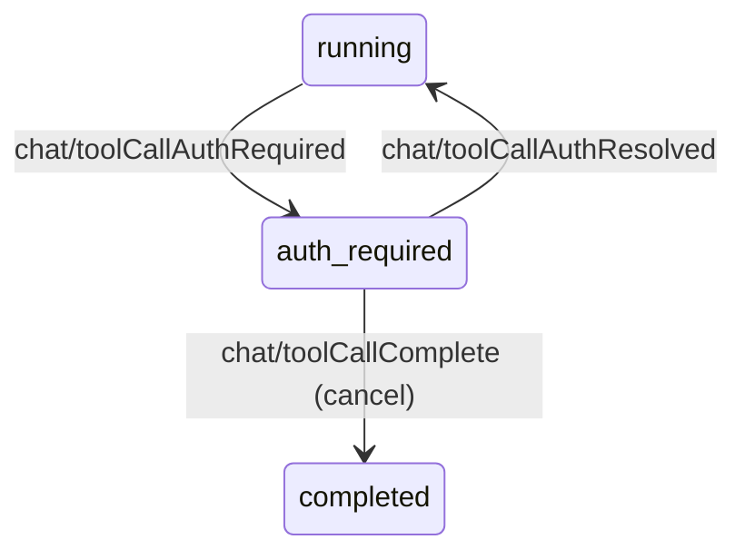
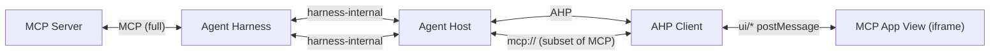

# MCP 伺服器

[模型上下文協定](https://modelcontextprotocol.io/) 伺服器在 AHP 中以 [`McpServerCustomization`](/reference/session#mcpservercustomization) 出現 - 一種自訂，表示工作階段中正在執行（或已註冊）的 MCP 伺服器。 AHP 故意**不要**重新規格 MCP。它暴露了：

- 足夠的狀態供用戶端渲染伺服器（名稱、圖示、啟用標誌、執行時間狀態）。
- 當伺服器需要時，足夠的狀態供用戶端驅動身份驗證。
- 當需要渲染 [MCP 應用程式](#mcp-apps) 時，用戶端可以使用可選的 [`mcp://` 側通道](/specification/mcp-channel) 與上游伺服器進行通訊。

其他一切 - 連線管理、傳輸、伺服器的 `command`/`args`/`env`、工具發現、請求扇出 - 都位於主機包裝的代理線束中。代理主機的工作是將線束公開的任何內容標準化為 AHP 狀態。

## MCP 伺服器出現的位置

MCP 伺服器可能出現在 [`SessionState.customizations`](/reference/session#sessionstate) 的兩個位置：

1. **作為容器自訂的子項** — 例如，在 `plugins.json` 清單內宣告或在目錄中發現的 MCP 伺服器。容器的`uri`指向清單檔案；子層級的 `range` 將其縮小到宣告的範圍。
2. **作為裸露的頂級條目** - 當全域配置而不是捆綁在插件或目錄中時，主機可以直接顯示 MCP 伺服器。

用戶端僅透過 `ClientPluginCustomization` 發布自訂項，因此用戶端貢獻的 MCP 伺服器始終作為用戶端插件的子級到達。頂級 `McpServerCustomization` 條目始終是主機發起的。


```typescript
state.customizations
  ?.flatMap(c => c.type === 'mcpServer' ? [c] : (c.children ?? []))
  .filter(c => c.type === 'mcpServer')
```


## 形狀


```typescript
McpServerCustomization {
  type: 'mcpServer'
  id: string                     // session-unique handle
  uri: URI                       // declaration source (file or marketplace URL)
  name: string
  icons?: Icon[]
  range?: TextRange              // span inside `uri` for inline declarations
  enabled: boolean               // user-toggleable (see Customizations guide)
  state: McpServerState // discriminated union — see below
  channel?: URI                  // optional mcp:// side-channel
  mcpApp?: McpServerCustomizationApps
}
```


`enabled` 遵循與任何其他容器相同的模型 - 它透過 `session/customizationToggled` 進行切換。停用伺服器會向主機發出訊號以停止它；然後，主機透過 `stopped` 轉換執行時，並將其從工作階段中刪除（或將其保留為 `stopped`，直到刪​​除，由主機選擇）。

用戶端也可以要求主機管理伺服器行程，而不更改自訂的啟用意圖：

- [`session/mcpServerStartRequested`](/reference/session#sessionmcpserverstartrequestedaction) 要求主機啟動或重新啟動現有的 MCP 伺服器自訂。reducer樂觀地將伺服器移動到 `starting` 並清除任何陳舊的 `channel`；主機保持權威並遵循`session/mcpServerStateChanged`。
- [`session/mcpServerStopRequested`](/reference/session#sessionmcpserverstoprequestedaction) 要求主機停止現有的 MCP 伺服器自訂。reducer樂觀地將伺服器移動到 `stopped` 並清除任何陳舊的 `channel`。停止 `authRequired` 伺服器可以解除其等待身份驗證的阻止；如果主機僅針對該伺服器提出了工作階段級輸入，則它應該在接受停止時刪除該輸入所需的條目。

## 運行時狀態

`state` 是[`kind` 上的判別聯集](/reference/session#mcpserverstatus)。它是主機對伺服器生命週期的看法，與 `enabled` （這是使用者的意圖）分開。





|親切 |意義|
|---|---|
| `starting` |已註冊但尚未運作。工具/資源不可用。 |
| `ready` |運行和服務請求。工具/資源透過通常的管道出現。 |
| `authRequired` |可以存取，但在身份驗證時被阻止。攜帶 `ProtectedResourceMetadata` 以使用戶端起作用。 |
| `error` |不可恢復的故障。帶有 `ErrorInfo`。對於特定於身份驗證的失敗，請使用 `authRequired`。 |
| `stopped` |關閉。主機可以在不久後刪除該條目。 |

高頻生命週期轉換透過狹窄的 [`session/mcpServerStateChanged`](/reference/session#sessionmcpserverstatuschangedaction) 操作，該操作僅在現有條目上更新插入 `state`（以及可選的 `channel`）。用戶端啟動/停止意圖經過 `session/mcpServerStartRequested` 和 `session/mcpServerStopRequested`；使用 `session/customizationUpdated` 表示其他任何內容（名稱、圖示、`mcpApp`）。

## 驗證

AHP 重複使用現有的 [`authenticate`](/reference/common#authenticate) 指令進行 MCP 伺服器驗證。該流程**完全由狀態** 驅動 - 沒有特定於 MCP 的通知。





`McpServerAuthRequiredState` 攜帶：

- **`reason`** — `required`、`expired` 或 `insufficientScope`。鏡像 [MCP 授權規格](https://modelcontextprotocol.io/specification/2025-11-25/basic/authorization.md) 失敗模式。
- **`oauthClient`** — 可選的預先註冊 OAuth 用戶端。如果存在，用戶端將使用其 `clientId`，而不是嘗試動態用戶端註冊。 `clientSecret` 識別機密用戶端；如果沒有，用戶端是公開的，並使用無秘密的流程，例如帶有 PKCE 的授權代碼。
- **`resource`** — [`ProtectedResourceMetadata`](/reference/common#protectedresourcemetadata) 根據 [RFC 9728](https://datatracker.ietf.org/doc/html/rfc9728)。內部的 `resource` 欄位是規範的 MCP 伺服器 URI（根據 RFC 8707）以及用戶端作為 `authenticate({ resource })` 傳回的內容。
- **`requiredScopes`** — 從 `WWW-Authenticate: Bearer scope="…"` 解析的範圍。對下一次授權請求具有權威性；用戶端不得假定與 `resource.scopes_supported` 有任何關係。
- **`description`** — 人類可讀的提示，通常是 OAuth `error_description`。

### 中間工具呼叫逐步身份驗證

`reason: 'insufficientScope'` 幾乎總是在工具呼叫期間浮出水面 — 模型呼叫 MCP 工具，上游伺服器回應 403，並且正在愉快地串流的回合突然需要使用者授予更多存取權限。 AHP 透過兩個訊號耦合這種情況，因此不會被錯過：

1. **當主機因正在進行的請求而將 MCP 伺服器轉換為 `authRequired` 時，主機應該在工作階段** 上引發 [`SessionStatus.InputNeeded`](/reference/session#sessionstatus)。這使得該區塊在工作階段-摘要層級可見，就像工具確認或輸入請求一樣。
2. **用戶端應觀察任何支援正在執行的工具所呼叫的 MCP 伺服器的 `state.kind`（透過 [`ToolCallContributor`](/reference/session#toolcallcontributor) — `{ kind: 'mcp', customizationId }`）。當伺服器翻轉到 `authRequired` 時，用戶端應該呈現與*該工具呼叫*相關的明確可供性（例如內聯「授予額外存取權限」按鈕），而不是依賴使用者在伺服器的自訂條目上發現狀態徽章。

相同的監控模式也涵蓋了`reason: 'expired'`中間輪 - 差異純粹在於使用者是否需要重新驗證或授予額外的範圍。

[`AgentInfo.protectedResources`](/reference/root#agentinfo) 中每個代理人受保護的資源涵蓋代理本身。 MCP 伺服器資源在此處進行自訂廣告，因此單一代理人可以攜帶任意數量的 MCP 伺服器，每個資源都有自己的授權伺服器，而不會導致根狀態膨脹。

`authenticate` 指令的 `resource` 欄位接受伺服器已通告的任何受保護資源識別碼 — 透過 `AgentInfo.protectedResources` 靜態發布，或透過即時 `McpServerAuthRequiredState.resource` 動態發布（或者，對於下面的工具呼叫層級狀態，則為 `ToolCallAuthRequiredState.auth.resource`）。以這種方式進行 MCP 驗證的伺服器不需要將資源鏡像到 `AgentInfo.protectedResources`。

### 工具呼叫級身份驗證

上面的 `McpServerAuthRequiredState` 描述了 *伺服器* 的生命週期 - 它在被阻止時無法服務**任何**請求。一個獨特的、一流的工具呼叫狀態，[`ToolCallStatus.AuthRequired`](/reference/chat#toolcallstatus)，描述了**特定的運行中工具呼叫**在同類挑戰上暫停：





- 伺服器使用 `auth: McpAuthRequirement` 物件調度 `chat/toolCallAuthRequired` — 與 `McpServerAuthRequiredState` 相同的 `{ reason, oauthClient?, resource, requiredScopes?, description? }` 形狀，減Go `kind`，並分解為共享的 `McpAuthRequirement` 接口，因此兩者都使用一個詞彙表描述相同的 OAuth 挑戰。它攜帶**不記名令牌**，儘管 `oauthClient` 可以攜帶配置的靜態用戶端憑證。
- 這通常是從 `running` 到達並傳回的 - 它不是 `ToolCallConfirmationState` （參數/結果確認聯集）的一部分，因為它不是由 `chat/toolCallConfirmed` 樣式的決策解決的。透過用戶端取得 `auth.resource` 的令牌並透過 `authenticate` 推送它來解決此問題；然後主機調度 `chat/toolCallAuthResolved` 來恢復呼叫。用戶端可以改為分派 `chat/toolCallComplete` 並傳回 **失敗** 結果（例如 `error.code: 'cancelled'`），以直接取消呼叫而無需進行驗證；reducer 以與從 `running` 相同的方式接受從 `auth-required` 的此轉換，但始終直接移動到 `completed` - 此路徑會忽略 `requiresResultConfirmation`，因為取消的身份驗證挑戰沒有實際結果可供查看。從 `auth-required` 分派的 **成功** 結果無效，reducer 將其視為無操作而忽略，將工具呼叫保留在 `auth-required` 中；只有失敗的結果才能完成它。
- 它僅適用於 MCP 貢獻的工具呼叫：`ToolCallAuthRequiredState.contributor` 被縮小為 `ToolCallContributor` 的 MCP 變體，因此不變的「需要身份驗證意味著 MCP 貢獻」在結構上是強制執行的，而不僅僅是記錄在案。
- 主機應該顯示帶有 `kind: 'toolAuthentication'` 的 `session/inputNeededSet` 條目（請參閱[聚合輸入請求](/specification/session-channel#aggregated-input-requests)），將被阻止的工具呼叫與其聊天和回合相關聯，因此僅觀看工作階段的用戶端可以透過 `authenticate` 發現並解決它，而無需訂閱聊天。

伺服器層級和工具呼叫層級狀態是獨立分派的，並且故意保持分離：「MCP 伺服器需要身份驗證」和「此特定呼叫正在等待該驗證」是不同的事實，並不總是一致（由一個工具呼叫觸發的升級挑戰不需要阻止整個伺服器）。

## MCP 工具的位置

MCP 工具遵循正常的 AHP 工具呼叫流程：

- 主機內的代理程式工具從每個 `ready` MCP 伺服器發現工具，主機將它們規範化到代理的工具目錄中，並透過 `chat/toolCallStart` / `chat/toolCallReady` / `chat/toolCallComplete` 公開呼叫。
- 原始 MCP 伺服器在工具呼叫：`{ kind: 'mcp', customizationId: <McpServerCustomization.id> }` 上由 [`ToolCallContributor`](/reference/session#toolcallcontributor) 來識別。用戶端可以使用它在工具呼叫旁邊呈現原始伺服器的名稱/圖示。

沒有單獨的「MCP 工具」狀態。從用戶端的角度來看，MCP 工具呼叫只是與 MCP 貢獻者的工具呼叫。

## MCP 應用程式

[MCP Apps](https://github.com/modelcontextprotocol/ext-apps/blob/main/specification/draft/apps.mdx) (SEP-1865) 讓 MCP 伺服器傳送主機為特定工具呼叫所呈現的 UI 資源（通常是 HTML 頁面）。此視圖在由 AHP 用戶端控制的沙箱內執行，並透過 `postMessage` 上的 JSON-RPC 進行互動。 AHP 的作用是為用戶端提供代表代理主機呈現該視圖所需的一切，僅此而已。

本節僅描述 AHP 級管道。關於 View ↔ 主機協定本身（`ui/*` 方法、`hostCapabilities`、`hostContext`、沙箱規則），請參閱上游 MCP 應用程式規格。

###分工





- **代理線束**：儲存與伺服器的底層 MCP 連線。線束如何將其公開給代理主機（代理、回呼、訊息匯流排等）是由線束定義的，並且在 AHP 之外。
- **代理主機**：將線束提供的任何內容標準化為 AHP 狀態。決定呼叫哪個工具來實例化應用程式。將用戶端透過 [`mcp://` 通道](/specification/mcp-channel) 發送的 MCP 流量的受限子集轉送到線束中。
- **AHP 用戶端**：在 `initialize` 上宣告 `capabilities.mcpApps`。渲染視圖。運行 `ui/initialize` 握手。提供 `hostContext`（主題、區域設定、維度等）和 `hostCapabilities` 的本地決定部分（`openLinks`、`downloadFile`、`sandbox`、`experimental`）。將工具輸入/結果通知傳遞到檢視。透過 `mcp://` 通道路由 `tools/*`、`resources/*`、`logging/*` 和 `sampling/*`。
- **視圖**：用戶端視為不可信的不透明 HTML 文件。 AHP 並未直接提及此事。

用戶端是與視圖對話的*唯一*方。 AHP 不承載 `ui/*` 流量 - 此協定存在於用戶端和 iframe 之間。

### 聲明支援

用戶端將 [`InitializeParams.capabilities.mcpApps`](/reference/common#initializeparams) 設為 `{}` 來選擇加入。主機應該僅在為聲明該功能的用戶端提供的自訂上填入 `mcpApp`（並公開相應的 `mcp://` 通道）。省略它的用戶端必須將應用程式承載工具呼叫視為普通的 MCP 工具呼叫。

### 發現應用程式支援

每個 [`McpServerCustomization`](/reference/session#mcpservercustomization) 可以透過 `mcpApp` 宣傳應用程式支援：


```typescript
McpServerCustomization {
  // ...
  channel?: URI
  mcpApp?: {
    capabilities: AhpMcpUiHostCapabilities
  }
}
```


只要伺服器可以託管應用程式，`mcpApp` 就應該存在。它的存在告訴用戶端「如果來自此伺服器的工具呼叫指向 UI 資源，您可以將其呈現為應用程式，這是我可以代表您滿足的 `hostCapabilities` 切片」。

[`AhpMcpUiHostCapabilities`](/reference/session#ahpmcpuihostcapabilities) 故意是上游 `HostCapabilities` 的 **子集**。它只涵蓋依賴主機與上游 MCP 伺服器關係的功能：

| AHP 能力 |主持人的承諾 | 用戶端傳遞給 `ui/initialize` 的內容 |
|---|---|---|
| `serverTools`| `tools/list` 和 `tools/call` 將透過 `mcp://` 通道進行代理。 `listChanged` 控制權是否轉送 `notifications/tools/list_changed`。 | `hostCapabilities.serverTools`（鏡像 `listChanged`）|
| `serverResources` | `resources/list`、`resources/templates/list` 和 `resources/read` 將會被代理。 `listChanged` 控制通知轉送。 | `hostCapabilities.serverResources` |
| `logging` |來自應用程式的 `notifications/message` 將會轉送到伺服器；來自伺服器的 `logging/setLevel` 將會到達應用程式。 | `hostCapabilities.logging`（`{}`）|
| `sampling` |來自應用程式的 `sampling/createMessage` 將在代理主機內部處理（通常由執行代理程式輪次的相同線束）。 `sampling.tools` 控制 SEP-1577 內容接受。 | `hostCapabilities.sampling` |

其他 `hostCapabilities` 欄位 — `openLinks`、`downloadFile`、`sandbox`、`experimental` — 取決於用戶端的渲染器（網路與桌面、它可以授予哪些權限、它強制執行什麼 CSP），並且**不**是 `AhpMcpUiHostCapabilities` 的一部分。用戶端在回應 `ui/initialize` 之前自行填充它們。

### 識別App工具呼叫

應呈現為應用程式的工具呼叫帶有兩個 AHP 級訊號：

1. **`contributor`** — `{ kind: 'mcp', customizationId }` 指向原始 [`McpServerCustomization`](/reference/session#mcpservercustomization)。尋找有關該自訂的 `mcpApp` 和 `channel`。
2. **`_meta.ui`** — AHP 工具呼叫的 `_meta` 可以攜帶 `ui` 欄位，逐字鏡像 MCP 應用的 `McpUiToolMeta`（通常為 `{ resourceUri?: string, visibility?: ('model' | 'app')[] }`）。用戶端應讀取 `resourceUri` 以了解哪個 UI 資源支援該呼叫。 AHP 不會重新輸入此形狀 - 用戶端透過 `_meta` 使用它。

如果 `_meta.ui.resourceUri` 不存在，則工具呼叫是普通的 MCP 工具呼叫，並且用戶端會正常渲染它。

### 端對端流程


```mermaid
sequenceDiagram
    participant Server as MCP Server
    participant Host as Agent Host
    participant Client as AHP Client
    participant View

    Note over Host,Client: Session subscription; mcpApp.capabilities visible

    Host->>Client: toolCallStart (contributor.mcp, _meta.ui.resourceUri)
    Host->>Client: toolCallReady

    Note over Client: Resolve resource via mcp:// (resources/read)
    Client->>Host: mcp:// resources/read (resourceUri)
    Host->>Server: resources/read
    Server-->>Host: HTML / metadata
    Host-->>Client: HTML / metadata

    Note over Client: Mount iframe, await View
    View->>Client: ui/initialize (postMessage)
    Client-->>View: ui/initialize result<br/>(hostCapabilities = local + mcpApp.capabilities,<br/>hostContext = theme/locale/dimensions)
    View->>Client: ui/notifications/initialized

    Note over Client: Pump tool input + result into the View
    Client->>View: ui/notifications/tool-input
    Host->>Client: toolCallComplete (result)
    Client->>View: ui/notifications/tool-result

    Note over View,Server: View now serves a UI; calls into MCP via the client
    View->>Client: tools/call (server tool)
    Client->>Host: mcp:// tools/call
    Host->>Server: tools/call
    Server-->>Host: result
    Host-->>Client: result
    Client-->>View: result
```


用戶端負責將任何本地支援的 `ui/*` 請求轉換為正確的本地可供性 - 例如`ui/open-link` 打開系統連結，`ui/request-display-mode` 切換渲染器的佈局，`ui/message` 成為 AHP 工作階段上的引導訊息或訊息，`ui/update-model-context` 成為下一條使用者 {c3或下一個訊息，{c212 成為下一個客戶端或下一個客戶端的訊息，{c212。

## 後續步驟

- [`mcp://` 通道](/specification/mcp-channel) — 側通道用戶端用於與上游伺服器通訊。
- [工作階段通道參考](/reference/session) — `McpServerCustomization`、`McpServerState` 和朋友的完整型別定義。