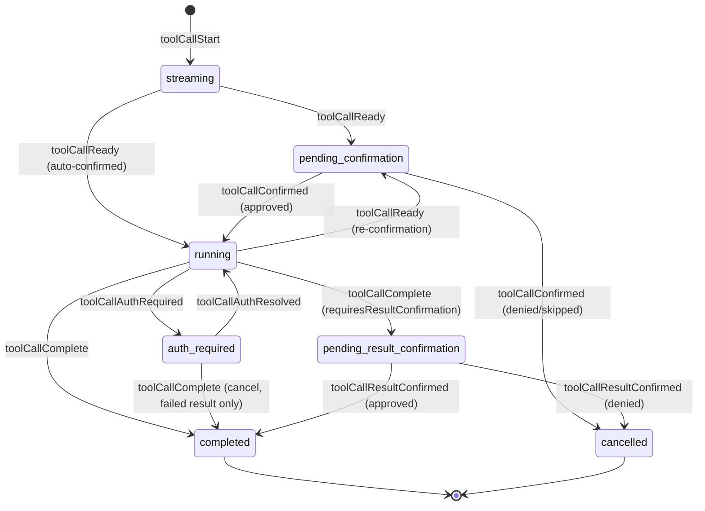
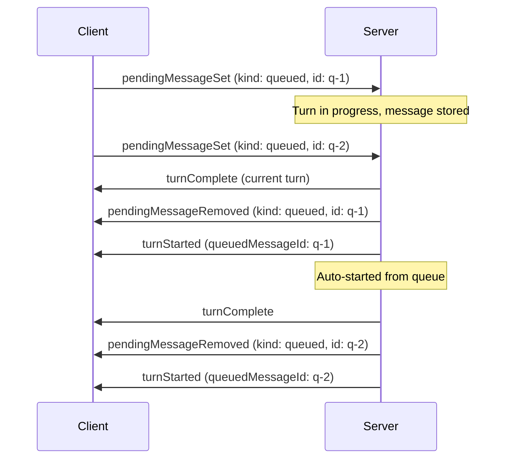
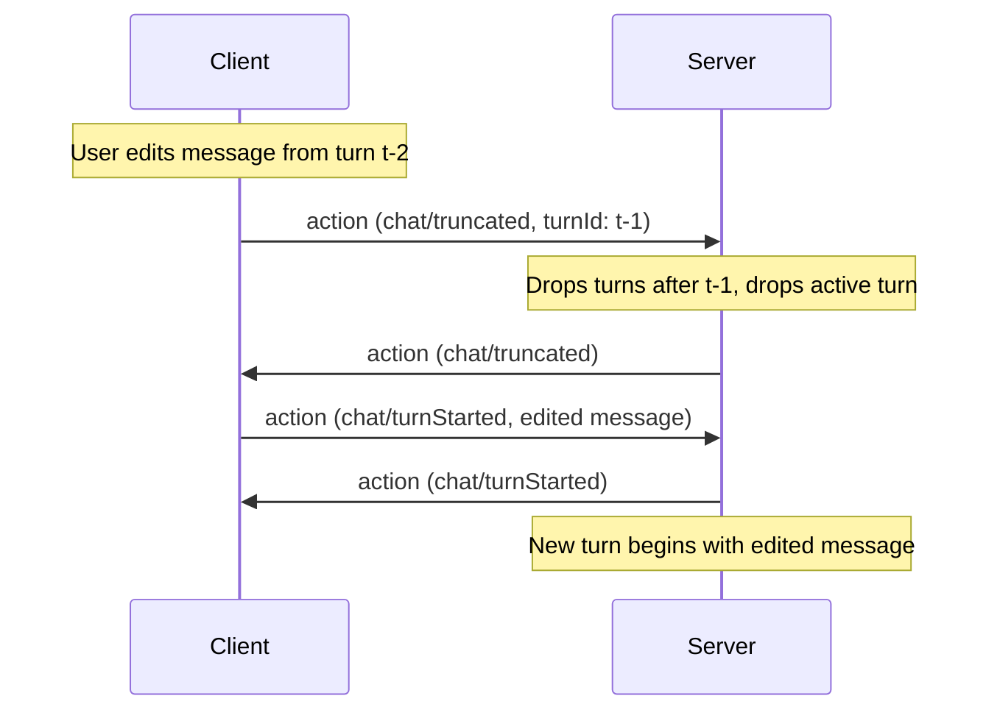

# 狀態型號

AHP 中的所有狀態都組織成**通道**，每個通道都由一個 URI 尋址。用戶端訂閱通道 URI 以接收其目前的狀態快照和後續操作更新。請參閱[通道與訂閱](/specification/subscriptions) 以了解通道模型。

## 根狀態

可在 [根通道](/specification/root-channel) 的 `ahp-root://` 上訂閱。包含所有用戶端所需的全域輕量級資料。 **不包含工作階段清單** - 透過 RPC 命令式取得（請參閱 [`listSessions`](/reference/root#listsessions)）並透過 `root/sessionAdded` / `root/sessionRemoved` / `root/sessionSummaryChanged` 通知保持同步。


```typescript
RootState {
  agents: AgentInfo[]
  activeSessions?: number     // count of non-disposed sessions
  terminals?: TerminalInfo[]  // lightweight terminal catalogue
  config?: RootConfigState    // host-level configuration
}
```


每個 `AgentInfo` 都包含可用於該代理人的模型：


```typescript
AgentInfo {
  provider: string         // e.g. 'copilot'
  displayName: string
  description: string
  models: SessionModelInfo[]
  customizations?: Customization[]  // Open Plugins
}

SessionModelInfo {
  id: string
  provider: string
  name: string
  maxContextWindow?: number
  supportsVision?: boolean
  policyState?: 'enabled' | 'disabled' | 'unconfigured'
  configSchema?: ConfigSchema   // model-specific options (e.g. thinking level)
  _meta?: Record<string, unknown>  // intrinsic facts (e.g. pricing); see below
}

ConfigSchema {
  type: 'object'
  properties: Record<string, ConfigPropertySchema>
  required?: string[]
}

ConfigPropertySchema {
  type: 'string'
  title: string
  description?: string
  default?: string
  enum: string[]                 // allowed values
  enumLabels?: string[]          // display labels (parallel array)
  enumDescriptions?: string[]    // descriptions (parallel array)
  readOnly?: boolean
}
```


當模型具有 `configSchema` 時，用戶端將其呈現為表單，並在 `ModelSelection` 中傳遞解析值（在每個 [`Message`](#user-messages) 上傳遞）。

`_meta` 攜帶額外的特定於提供者的元資料。用戶端可以在此處找到眾所周知的按鍵以提供增強的 UI - 例如，`pricing` 鍵可能攜帶模型定價元資料。

根狀態僅由源自伺服器的操作（例如 `root/agentsChanged`）突變。

## 工作階段狀態

可在 [工作階段通道](/specification/session-channel) 的 `ahp-session:/<uuid>` 上訂閱。包含單一工作階段的完整狀態。


```typescript
SessionState {
  // Session metadata, inlined directly (mirrored into the root-channel SessionSummary)
  provider: string
  title: string
  status: number        // SessionStatus bitset
  activity?: string
  project?: ProjectInfo
  workingDirectories?: URI[]   // equal-peer working directories
  annotations?: AnnotationsSummary

  lifecycle: 'creating' | 'ready' | 'creationFailed'
  creationError?: ErrorInfo
  chats: ChatSummary[]                     // catalog of chats in this session
  defaultChat?: URI                        // input-routing hint
  activeClients: SessionActiveClient[]
  customizations?: Customization[]         // active session plugins
  changesets?: Changeset[]
  config?: SessionConfigState
}
```


上面的工作階段元資料欄位內聯到 `SessionState`。相同的欄位被鏡像到根通道上的輕量級 [`SessionSummary`](#session-summary) 目錄條目中；主機透過週期性的`root/sessionSummaryChanged`使兩者保持同步。

### 生命週期

`lifecycle` 欄位追蹤非同步建立過程。當用戶端建立工作階段時，它會選擇一個 URI、發送指令並立即訂閱。初始快照有`lifecycle: 'creating'`。伺服器非同步初始化後端並分派 `session/ready` 或 `session/creationFailed`。

### 工作階段摘要

在工作階段清單中使用並嵌入在工作階段狀態中的輕量級元資​​料：


```typescript
SessionSummary {
  resource: URI
  provider: string
  title: string
  status: number  // SessionStatus bitset
  activity?: string
  createdAt: string   // ISO 8601, e.g. "2025-03-10T18:42:03.123Z"
  modifiedAt: string  // ISO 8601
  project?: ProjectInfo
  workingDirectories?: URI[]   // equal-peer working directories
  annotations?: AnnotationsSummary
  changes?: ChangesSummary
}

ProjectInfo {
  uri: URI
  displayName: string
}
```


`status` 位元集對工作階段的活動狀態和元資料標誌（例如讀取/存檔狀態）進行編碼。有關詳細資訊，請參閱下面的[工作階段狀態位集](#session-status-bitset)表。

### 工作階段狀態位集

`status` 是一個數字位集。用戶端應使用位元檢查而非對活動狀態進行字串或相等檢查：

|名稱 |價值|比特|意義|
|------------------------ | | ----：| ---------------------- |------------------------------------------------------------------------------------------------------------------------------------------------------------------------------------------------ |
| `SessionStatus.Idle` | `1` | `1 << 0` |沒有活動回合，也沒有待處理的輸入請求。                                                                                                                                          |
| `SessionStatus.Error` | `2` | `1 << 1` |最近的回合以錯誤結束。|
| `SessionStatus.InProgress` | `8` | `1 << 3` |回合已啟動。                                                                                                                                                                     |
| `SessionStatus.InputNeeded` | `24` | `(1 << 3) \| (1 << 4)` |一輪處於活動狀態，至少一個使用者輸入請求已打開，或至少一個工具呼叫正在等待使用者確認（執行前或執行後）。包括 `InProgress` 位。 |
| `SessionStatus.IsRead` | `32` | `1 << 5` |自上次修改以來，用戶端已檢視此工作階段。當新一輪開始或輸入請求到達時自動清除。透過 `session/isReadChanged` 切換。        |
| `SessionStatus.IsArchived` | `64` | `1 << 6` | 工作階段已由用戶端存檔。透過 `session/isArchivedChanged` 切換。|

位元 0-4 編碼互斥的 **活動** 狀態（一次只設定一個）。位元 5+ 編碼正交**元資料**標誌，可以透過位元或與任何活動狀態組合。

例如，`(status & SessionStatus.InProgress) !== 0` 對於 `InProgress` 和 `InputNeeded` 均成立。空閒、已讀取和已存檔的工作階段的狀態為 `1 | 32 | 64 = 97`。

## 聊天狀態

可在 [聊天通道](/specification/chat-channel) 訂閱：`ahp-chat:/<cid>`。工作階段是聊天目錄 (`SessionState.chats`)；每個聊天都包含每個對話狀態 - 回合歷史記錄、活動回合及其串流響應部分（包括即時輸入請求）、工具呼叫、引導/排隊訊息以及使用者正在進行的草稿。工作階段以預設聊天 (`SessionState.defaultChat`) 開始；通告 `multipleChats` 功能的主機讓用戶端透過 `createChat` 開啟更多內容。


```typescript
ChatState {
  // Chat summary fields, inlined directly (mirrored into SessionState.chats)
  resource: URI
  title: string
  status: number          // SessionStatus bitset
  activity?: string
  modifiedAt: string
  origin?: ChatOrigin      // how the chat came to exist (user / fork / sideChat / tool)
  workingDirectories?: URI[]      // subset of session's workingDirectories
  primaryWorkingDirectory?: URI      // this chat's primary, read-only (set at creation, when requiresPrimary)

  turns: Turn[]                       // completed turns
  turnsNextCursor?: string            // page older turns via fetchTurns
  activeTurn?: ActiveTurn             // the in-progress turn, if any
  steeringMessage?: PendingMessage
  queuedMessages?: PendingMessage[]
  draft?: Message                     // user's in-progress input
}
```


分叉和側聊建立都透過穩定的標識符來引用來源。
兩種來源形式都受到充分區分 - `{ kind: 'fork', chat, turnId }`
和`{ kind: 'sideChat', chat, turnId, selection? }`。對於邊聊，主持人
在建立時根據 `activeTurn` 或歷史 `turns` 解析 `turnId`
時間。如果它命名了活動輪次，則主機會快照目前可用的輪次
那裡的回應，保留了 `/btw` 風格的側聊，即使是相同的
稍後轉完成後將移至 `turns`。當 `selection` 存在時，
主機還將精確選定的文字（必須非空）快照到
建立的聊天的`origin`；`responsePartId` 有諮詢出處，而不是
一個範圍。

下面的部分——輪次、回應部分、工具呼叫、待處理訊息和輸入請求——描述了 `ChatState` 的內容。

## 回合

一輪代表使用者和代理之間的一個請求/回應週期。

### 已完成回合


```typescript
Turn {
  id: string
  message: Message
  responseParts: ResponsePart[]     // all content in stream order
  usage: UsageInfo | undefined
  state: 'complete' | 'cancelled' | 'error'
  error?: ErrorInfo
}
```


### 主動回合

助手正在主動直播的正在進行的回合：


```typescript
ActiveTurn {
  id: string
  message: Message
  responseParts: ResponsePart[]     // all content in stream order
  usage: UsageInfo | undefined
}
```


### 使用者留言


```typescript
Message {
  text: string
  origin: { kind: MessageKind }
  attachments?: MessageAttachment[]
  model?: ModelSelection   // selection this message was/will-be sent with
  agent?: AgentSelection   // custom agent this message was/will-be sent with
  _meta?: Record<string, unknown>  // provider-specific metadata; see below
}

ModelSelection {
  id: string                             // model ID
  config?: Record<string, string>        // model-specific config values
}

AgentSelection {
  uri: URI                               // stable custom-agent URI
}

type MessageAttachment =
  | SimpleMessageAttachment            // type: 'simple'
  | MessageEmbeddedResourceAttachment  // type: 'embeddedResource'
  | MessageResourceAttachment          // type: 'resource'

// Common fields shared by all variants:
MessageAttachmentBase {
  label: string                  // human-readable label, e.g. filename
  range?: TextRange              // range in `text` that references this attachment
  displayKind?: 'image' | 'document' | 'symbol' | 'directory' | 'selection' | string
  _meta?: Record<string, unknown>
}

TextRange {
  start: { line: number, character: number }  // zero-based text position
  end: { line: number, character: number }
}

TextSelection {
  range: TextRange
}

MessageResourceAttachment {
  type: 'resource'
  uri: URI
  displayKind?: 'selection'
  selection?: TextSelection
}
```


訊息的 `origin.kind` 記錄誰產生了該訊息：`user` 表示直接使用者訊息，`agent` 表示代理人自行產生的訊息，`tool` 表示工具產生的訊息（例如，播種它產生的工作聊天的第一訊息），`systemNotification` 表示系統產生的通知。對於啟動輪次的訊息來說，這也是輪次的起源；對於轉向或排隊訊息，它只是該訊息的來源。用戶端只允許發送 `user` 訊息。

訊息的可選 `model` / `agent` 記錄了它曾經或將要發送的選擇。對於歷史回合，這是實際使用的選擇，因此用戶端編輯或重新發送訊息可以保留它；省略時，將應用代理主機的預設值。聊天也會公開 `draft`：使用者正在撰寫但尚未發送的 [`Message`](#user-messages)（包括其 `model` / `agent`）。用戶端可以定期透過 `chat/draftChanged` 將其輸入狀態同步到 `draft`（Go抖，不急切），並且應該從任何當前的 `draft` 初始化現有聊天的輸入 UI。

附件可以由 `text` 透過可選的 `range` 欄位內聯引用，該欄位指向訊息文字中的跨度。這是文字範圍，而不是位元組範圍。沒有範圍的附件仍與訊息關聯，但不會錨定到特定範圍。

資源和嵌入資源附件也可以包括 `selection` 以標識附加文字資源中的選定範圍。這與 `range` 不同，後者僅描述使用者訊息文字中引用附件的位置。選定的文字不是內嵌的；消費者可以在需要時解析資源並讀取所選範圍。 `selection`僅對文字資源有意義；二進位資源仍可使用資源或嵌入資源附件，但不應使用此文字選擇欄位。

使用 `SimpleMessageAttachment` 表示其模型表示由生產者提供的不透明附件，使用 `MessageEmbeddedResourceAttachment` 表示小型內嵌 Base64 負載（例如貼上的圖像），使用 `MessageResourceAttachment` 透過 URI 引用資源（需要時透過 `resourceRead` 取得內容）。

`Message._meta` 攜帶訊息本身的附加特定於提供者的元資料（獨立於任何附件 `_meta` blob）。用戶端可以在此處找到眾所周知的鍵以提供增強的 UI，並且代理主機可以使用它來攜帶不適合任何其他欄位的上下文。鏡像 [MCP `_meta` 約定](https://modelcontextprotocol.io/specification/2025-06-18/basic#meta)。

[`completions`](#user-message-completions) 指令產生的附件可以包含 `_meta` blob；在使用者訊息中回顯附件時，用戶端必須保留 `_meta` 的每個屬性。

### 使用者訊息完成

為了支援 `@` 提及選擇器和類似的內聯完成體驗，用戶端可以在使用者撰寫訊息時呼叫 `completions` 指令：


```typescript
CompletionsParams {
  kind: 'userMessage'      // CompletionItemKind.UserMessage
  channel: URI
  text: string             // full text typed so far
  offset: number           // cursor offset (UTF-16 code units)
}

CompletionsResult {
  items: CompletionItem[]
}

CompletionItem {
  insertText: string
  rangeStart?: number      // range in `text` to replace; insertion at cursor if omitted
  rangeEnd?: number
  attachment: MessageAttachment
}
```


伺服器透過 `InitializeResult.completionTriggerCharacters`（例如 `['@', '#']`）通告應自動觸發此請求的字元。用戶端也可以發出 `completions` 呼叫以回應明確的使用者操作（例如鍵盤快速鍵）。當使用者接受某個項目時，用戶端會將輸入中的 `[rangeStart, rangeEnd)` 替換為 `insertText`，並將該項目的 `attachment` 與產生的 `Message` 相關聯。

支援常見終端機指令簡寫的主機將 `InitializeResult.terminalCommandPrefix` 通告為 `"!"`。用戶端可以使用該標記來解釋以 `!` 開頭的訊息將被主機解釋為終端機指令；當標記不存在時，用戶端應該將 `!` 前綴的文字視為普通使用者訊息。

## 回應部分

所有回應內容（文字、工具呼叫、推理和內容引用）均按流順序儲存在單一 `responseParts` 陣列中。這反映了 LLM API（例如 OpenAI）如何將回應表示為統一的鍵入項目清單。


```typescript
// Inline markdown content
MarkdownResponsePart {
  kind: 'markdown'
  id: string               // targeted by chat/delta for text appends
  content: string
}

// Reasoning/thinking content from the model
ReasoningResponsePart {
  kind: 'reasoning'
  id: string               // targeted by chat/reasoning for text appends
  content: string
}

// Tool call (see Tool Call Lifecycle below)
ToolCallResponsePart {
  kind: 'toolCall'
  toolCall: ToolCallState   // full lifecycle state
}

// Reference to large content stored outside the state tree
ContentRef {
  kind: 'contentRef'
  uri: string              // scheme://sessionId/contentId
  sizeHint?: number
  contentType?: string
}

// Harness-authored notification surfaced in the stream (e.g. "subagent finished")
SystemNotificationResponsePart {
  kind: 'systemNotification'
  content: StringOrMarkdown
  _meta?: Record<string, unknown>   // machine-readable trigger metadata; see below
}

// Durable record of a resolved input request (see Input Requests below)
InputRequestResponsePart {
  kind: 'inputRequest'
  request: ChatInputRequest   // the resolved request, with its final answers
  response: ChatInputResponseKind  // 'accept' | 'decline' | 'cancel'
}
```


`SystemNotificationResponsePart._meta` 攜帶特定於提供者的元資料，描述觸發通知的原因。主機可以附加機器可讀的描述符，以便用戶端可以對通知進行分類、圖示、分組、過濾或本地化，而無需解析 `content`。用戶端可以檢查眾所周知的鍵以增強 UI，並且當 `_meta` 不存在或無法識別時，必須單獨從 `content` 進行連貫渲染。

文字內容使用 **create-then-append** 模式：伺服器首先發出 `chat/responsePart` 操作，以使用 `id` 建立新的降價（或推理）部分，然後透過針對該 `partId` 的 `chat/delta`（或 `chat/reasoning`）操作將文字串流傳輸到其中。這種模式可以擴展到未來的串流內容類型。

用戶端透過 `resourceRead(uri)` 指令單獨取得 `ContentRef` 內容。這使得狀態樹保持較小且可序列化。

消費者可以透過連線所有 `markdown` 部分來導出顯示文本，透過過濾 `toolCall` 部分查找工具呼叫，並透過過濾 `reasoning` 部分存取推理。

## 工具呼叫生命週期

工具呼叫表示為 `status` 上的判別聯集，其中每個狀態僅公開對該階段有效的欄位。





### 州

|狀態 |關鍵領域 |說明 |
------------------------------------------------ |-------------------------------------------------------------------------------------------------------------------------------- -------------------------------------------------------------------------------------------------------------------------------------------------------------------------------------------------------------------------------- || `streaming` | `partialInput?` | LM是串流工具呼叫參數。 `partialInput` 透過 `toolCallDelta` 累積。                                                                                                                                                                                                  |
| `pending-confirmation` | `invocationMessage`、`toolInput?`、`edits?`、`editable?`、`options?` |需參數完整或執行中期確認。 `edits` 預覽檔案更改。 `editable`表示用戶端可以在確認之前編輯參數。 `options` 提供了伺服器定義的選擇，而不僅僅是簡單的批准/拒絕（見下文）。使用 `_meta` 作為附加上下文。 |
| `running` | `confirmed`，`selectedOption?` |工具正在執行。 `confirmed` 記錄其核准方式。 `selectedOption` 儲存所選的確認選項（如果有）。|
| `auth-required` | `confirmed`、`selectedOption?`、`contributor` (MCP)、`auth` |執行已暫停，等待 MCP 驗證（見下文）。僅可透過 MCP 貢獻的工具呼叫進行存取。                                                                                                                                                                               |
| `pending-result-confirmation` | `success`、`pastTenseMessage`、`content?`、`selectedOption?` |執行完畢，等待用戶端批准結果。                                                                                                                                                                                                                          || `completed` | `success`、`pastTenseMessage`、`content?`、`selectedOption?` | 終端機狀態。工具完成。                                                                                                                                                                                                                                                         |
| `cancelled` | `reason`、`reasonMessage?`、`userSuggestion?`、`selectedOption?` | 終端機狀態。 `reason` 是 `'denied'`、`'skipped'` 或 `'result-denied'`。                                                                                                                                                                                                             |

`confirmed`、`selectedOption?` 被拉入共享的 `ToolCallPostConfirmationFields` 基底中，因為對於僅在 `pending-confirmation` 之後可到達的每個狀態，不變數（「確認已解決」）成立：`running`、`auth-required`、`pending-result-confirmation` 和 `completed`。 `pending-confirmation` 本身（尚未確認）和 `cancelled` （拒絕路徑，從未執行）保留自己的欄位。

### 執行中再次確認

當正在執行的工具需要額外的使用者批准（例如 shell 權限）時，伺服器會再次調度 `chat/toolCallReady`，而不需要 `confirmed`。這會將工具呼叫從 `running` 轉換回 `pending-confirmation`，並使用有關需要批准的內容的上下文更新 `invocationMessage` 和 `_meta`。用戶端使用標準 `chat/toolCallConfirmed` 流程來批准或拒絕。

### 執行中 MCP 驗證

由 MCP 伺服器 (`contributor.kind === 'mcp'`) 提供的 `running` 工具呼叫可能會在驗證質詢時暫停 - 當底層 `tools/call` 傳回的範圍不足時，最常見的是逐步驗證。伺服器使用 `auth: McpAuthRequirement` 物件調度 `chat/toolCallAuthRequired`（`reason`、`resource`、`requiredScopes?`、`description?` - 無令牌），轉換 `running` → `auth-required`。這是**一流的狀態**，而不是一般的“阻止”狀態：它的存在是因為解決路徑（取得令牌，呼叫 `authenticate`）與 `chat/toolCallConfirmed` 批准/拒絕決策不同。

主機也應該使用 `toolAuthentication` 條目引發 `session/inputNeededSet`（請參閱[聚合輸入請求](/specification/session-channel#aggregated-input-requests)），以便該區塊在不訂閱聊天的情況下可見。一旦用戶端取得 `auth.resource` 的令牌並透過 `authenticate` 推送它，主機就會分派 `chat/toolCallAuthResolved`，將 `auth-required` 轉換回 `running`，並保留暫停之前的欄位（`invocationMessage`、`toolInput`、`confirmed`、{c2177}）。

用戶端可以透過分派帶有 **失敗** 結果的 `chat/toolCallComplete`（例如 `error.code: 'cancelled'`）來取消呼叫，而無需進行身份驗證。 reducer 接受來自 `auth-required` 的此轉換，就像從 `running` 接受此轉換一樣，但始終直接轉換到 `completed` — `requiresResultConfirmation` 在此路徑上被忽略，並且永遠無法進入 `pending-result-confirmation`，因為取消的身份驗證挑戰不會產生可供查看的實際結果。除非分派結果提供自己的結果，否則會保留 `confirmed`、`selectedOption`、`contributor`、`invocationMessage`/`toolInput` 和任何預驗證部分 `content`。

從 `auth-required` 分派的 **成功** 結果 (`result.success: true`) 無效：挑戰後從未恢復執行，因此沒有任何內容可以產生真正的結果。 reducer 將其視為無操作而拒絕 - 工具呼叫仍為 `auth-required` - 而不是讓用戶端透過宣告成功來繞過待處理的驗證。只有 `chat/toolCallAuthResolved`（在真正的令牌交換之後）恢復對 `running` 的呼叫。

這是故意與 `McpServerAuthRequiredState` **分開**（MCP 伺服器自己的 `authRequired` 生命週期狀態，請參閱 [MCP 伺服器](/guide/mcp#authentication)）：伺服器說「我需要身份驗證」和特定工具呼叫說「我正在等待該驗證工具。

### 可編輯參數

當 `editable` 在 `pending-confirmation` 工具呼叫中為 `true` 時，用戶端可能允許使用者在確認先前修改工具的輸入參數。如果使用者編輯參數，則用戶端會在 `chat/toolCallConfirmed` 操作中包含 `editedToolInput`。當轉換到 `running` 時，reducer 使用 `editedToolInput`（如果存在）來取代原始的 `toolInput`。

當一輪完成時，`responseParts` 中的非終端機工具呼叫將被強制取消，原因是 `'skipped'`。

### 確認選項

預設情況下，用戶端為 `pending-confirmation` 工具呼叫呈現二進位批准/拒絕 UI。伺服器可以透過 `options` 提供更豐富的選擇 - `ConfirmationOption` 物件陣列，每個物件具有：

|領域 | 型別 |描述 |
| -------- | -------------------- | ------------------------------------------------------------------------------------------------------------------------------------------------------------------ |
| `id` | `string` |唯一標識符，在 `chat/toolCallConfirmed` 操作中傳回為 `selectedOptionId`。                                                                        |
| `label` | `string` |按鈕或選單項目的人類可讀文字。伺服器應使用用戶端的 `locale`（在 `initialize` 中發送）對其進行本地化。                                |
| `kind` | `'approve' \| 'deny'` |對選項進行分類，以便伺服器和用戶端知道它代表批准或拒絕。|
| `group` | `number?` |邏輯組號。用戶端應依照定義的順序顯示選項，並且可以使用不同的組號在邏輯叢集之間插入分隔符號。 |

例如，伺服器可能提供 `"Approve"`、`"Approve in this Session"`、`"Deny"` 和 `"Deny with reason"`。當使用者選擇選項時，用戶端會調度 `chat/toolCallConfirmed`，並將 `selectedOptionId` 設定為所選選項的 `id`。 reducer 解析完整的 `ConfirmationOption` 物件，並將其作為 `selectedOption` 儲存在生成的 `running` 或 `cancelled` 狀態上，然後繼續傳遞到 `completed`。

## 輸入請求

聊天可以請求使用者的結構化輸入，並在其活動回合中使用即時回應部分：


```typescript
InputRequestResponsePart {
  kind: 'inputRequest'
  request: ChatInputRequest
  response?: 'accept' | 'decline' | 'cancel'
}
```


不存在的 `response` 標記為即時請求。 `chat/inputCompleted` 在同一部分設定反應，保留其反應流位置和轉錄歷史記錄。有關請求生命週期、問題和答案形狀、URL 請求、多用戶端草稿同步和驗證規則，請參閱[Elicitation](/guide/elicitation)。

## 使用資訊

每回合報告的令牌使用：


```typescript
UsageInfo {
  inputTokens?: number
  outputTokens?: number
  model?: string
  cacheReadTokens?: number
  _meta?: Record<string, unknown>
}
```


`_meta` 攜帶使用情況報告的特定於提供者的元資料。用戶端可以檢查眾所周知的可選鍵以提供增強的 UI。

## 工作階段列表

工作階段列表可以任意大，並且**不是** 狀態樹的一部分。反而：

- 用戶端透過 `listSessions()` RPC 指令式取得清單。
- 伺服器發送輕量級 **通知** 以保持連線的用戶端' 快取同步，而無需重新取得：
  - `root/sessionAdded` 和 `root/sessionRemoved` 訊號生命週期（建立和處置）。
  - `root/sessionSummaryChanged` 將部分更新串流傳輸到現有工作階段的摘要（標題、狀態、`modifiedAt`、項目、工作目錄），以便顯示工作階段清單的用戶端可以保持同步，而無需單獨訂閱每個工作階段 URI。只有 `changes` 中存在的欄位才帶有新值；省略的欄位不變。每當任何可變摘要欄位發生變更時，伺服器都應該發出此通知，並且可以自行決定合併或消除雜訊更新（例如，在回合傳輸時快速的 `modifiedAt` 碰撞）。

通知是短暫的－不被reducers處理，不儲存在狀態中，不在重新連線時重播。重新連線時，用戶端重新取得清單。

## 待處理訊息

每個聊天都維護兩個可選的**待處理訊息** - 排隊等待將來傳遞給代理的指令：


```typescript
ChatState {
  // ...existing fields...
  steeringMessage?: PendingMessage      // inject into current turn
  queuedMessages?: PendingMessage[]     // start as new turns
}

PendingMessage {
  id: string
  message: Message
}
```


### 轉向訊息

轉向訊息在方便的點注入**當前回合**。用戶端設定引導訊息來引導代理程式在飛行中 — 例如，告訴它專注於特定檔案或變更方法。一次僅存在一條轉向訊息；新增新的將替換任何現有的。

- 當聊天處於活動狀態時，伺服器自行決定使用轉向訊息，並在執行時調度 `chat/pendingMessageRemoved`。
- 當空閒時設定時，轉向訊息會默默儲存，直到回合開始。

### 排隊訊息

當前回合結束後，排隊的訊息將自動作為**新回合**啟動。伺服器對它們進行 FIFO 處理（按到達順序）。

- 當一輪完成並且存在排隊訊息時，伺服器會刪除第一個排隊訊息並從中開始新一輪。
- 當聊天空閒時新增排隊訊息時，伺服器應立即使用它並開始回合。
- 產生的 `chat/turnStarted` 操作包括連結回來源排隊訊息的 `queuedMessageId` 欄位。





### 管理

用戶端可以隨時使用帶有 `kind` 判別式（`'steering'` 或 `'queued'`）的 `chat/pendingMessageSet`（upsert）和 `chat/pendingMessageRemoved` 操作**設定**或**刪除**轉向訊息和排隊訊息。

## 聊天截斷

`chat/truncated` 操作會從聊天中刪除回合歷史記錄。它是 **用戶端-可分派** — 任何一方都可以截斷。如果聊天處於活動狀態，則會靜默中斷，並且聊天狀態會回到 `idle`。

- **使用 `turnId`** — 保留指定回合之前的所有回合（包括指定回合）；刪除其後的所有內容。
- **沒有 `turnId`** — 刪除所有回合（清除聊天）。

一個常見的模式是截斷，然後立即使用編輯後的訊息開始新一輪：





如果在已完成的輪數陣列中找不到 `turnId`，則該操作為無操作。

## 工作階段分叉

透過在 `createSession` 中提供可選的 `fork` 欄位，可以將新的工作階段建立為現有工作階段的**分支**。伺服器使用來自來源工作階段的內容填入新的工作階段，直到並包含指定回合的回應。


```typescript
createSession({
  session: 'ahp-session:/<new-uuid>',
  provider: 'copilot',
  fork: {
    session: 'ahp-session:/<source-uuid>',
    turnId: 't-3',     // copy turns through t-3
  },
});
```


分叉的工作階段是一個獨立的副本 - 對任一工作階段的後續更改不會影響另一個。伺服器像往常一樣為新的工作階段廣播 `root/sessionAdded`。

## 多根工作階段

當工作階段被授予對多個工作目錄的工具存取權限時，
代理通告 `multipleWorkingDirectories` 功能。在工作階段
目錄的等級總是**平等** - 工作階段沒有主目錄。一個
**主要**是每個聊天的概念（參見[下文](#per-chat-working-directory-subsets)）；
工作階段只是擁有每個聊天從中提取的集合。

### 建立多根目錄工作階段

在 `createSession` 中傳遞 `workingDirectories`（複數）。當代理
`requiresPrimary`，也透過 `primaryWorkingDirectory` - 它播種主要
工作階段的**預設聊天**（工作階段本身不儲存主要內容）：


```typescript
createSession({
  channel: 'ahp-session:/<uuid>',
  provider: 'copilot',
  workingDirectories: [
    'file:///workspace/frontend',
    'file:///workspace/backend',
  ],
  primaryWorkingDirectory: 'file:///workspace/frontend',  // seeds default chat, when requiresPrimary
});
```


除非代理商發布廣告，否則用戶端不得傳遞多個條目
`multipleWorkingDirectories`。沒有該功能的伺服器僅處理
第一個條目作為工作階段的工作目錄並忽略其餘條目。

當代理通告 `multipleWorkingDirectories.requiresPrimary` 時，用戶端
應提供 `primaryWorkingDirectory` （必須是以下之一
`workingDirectories`);主機可以拒絕忽略它的建立，或回退
到第一個條目。它變成預設聊天的唯讀
`ChatState.primaryWorkingDirectory`。

> **如果工作階段沒有，為什麼 `primaryWorkingDirectory` 位於 `createSession` 上
> 主要？ ** 因為 `createSession` 隱式建立了工作階段的 **預設值
> 聊天**，並且沒有單獨的 `createChat` 呼叫來承載該聊天
> 建立時間欄位。該欄位是唯一指定預設值的地方
> 聊天是出生時的主要活動。對於任何其他聊天，請將其主要聊天傳遞給
> 改為 `createChat`。

分叉的工作階段忽略 `workingDirectories` / `primaryWorkingDirectory` - 他們
繼承來源工作階段的工作目錄（和每個聊天的主目錄）。

### 建立後管理目錄

目錄集是狀態 (`SessionState.workingDirectories`)，因此用戶端
透過**調度操作**來改變它，而不是透過呼叫命令：

|行動|效果|
| --- | --- |
| `session/workingDirectorySet` |將 `directory` 加入集合（如果不存在則建立它）。當目錄已經存在時無操作。 |
| `session/workingDirectoryRemoved` |從集合中刪除 `directory`。當它不存在時，無操作。不存在原子後端「刪除一個」原語——主機將其代理重新配置為縮減集合。主機可以拒絕套用刪除（例如，仍指定為某些聊天的主要目錄），使該集合保持不變。 |

都是`@clientDispatchable`。觀察結果集
`SessionState.workingDirectories` 與任何其他狀態一樣 — 沒有單獨的
結果有效負載。

在分派任一操作之前，用戶端必須驗證代理是否通告
`multipleWorkingDirectories`。

### 每個聊天的工作目錄子集

多根工作階段中的每個聊天都可能進一步限制其目錄
用於工作階段的 `workingDirectories` 的**子集**。這讓
同一工作階段中的不同聊天各自關注內容的不同部分
工作區 - 例如，前端聊天和後端聊天。

聊天的有效集合記錄在`ChatState.workingDirectories` /
`ChatSummary.workingDirectories`。當缺席時，聊天將繼承完整的
工作階段設定。

聊天還指定其自己的**主**工作目錄 -
`ChatState.primaryWorkingDirectory`（鏡像在 `ChatSummary` 上）。它是
**只讀並在聊天建立時固定**：沒有任何操作可以更改它，並且
它不參與`session/chatUpdated`。僅當代理時出現
`requiresPrimary`。每個聊天可以從其自己的有效中選擇不同的主要
目錄。

#### 建立時設定

將 `workingDirectories` 傳給 `createChat`。每個條目必須已經存在於
工作階段的 `workingDirectories`。當代理人`requiresPrimary`時，也透過
`primaryWorkingDirectory`（聊天的有效目錄之一）：


```typescript
createChat({
  channel: 'ahp-session:/<uuid>',
  chat: 'ahp-chat:/<uuid>',
  workingDirectories: ['file:///workspace/frontend'],  // subset
  primaryWorkingDirectory: 'file:///workspace/frontend',  // this chat's primary, when requiresPrimary
});
```


分叉聊天（其 `source.kind` 為 `"fork"` 的聊天）繼承來源
聊天的 `workingDirectories` 和主要欄位，因此對於分叉來說這兩個欄位都會被忽略。
邊聊仍然可以選擇自己的子集和主要內容，
他們仍然用穩定的 `turnId` 引用他們的來源，無論那輪
建立側聊天時處於活動狀態或歷史狀態。他們還可以保留
`origin.selection` 中的選定文字快照；當該快照已修復時
主持人接受 `createChat` 並且不遵循對來源聊天的後續編輯。

#### 建立後管理子集

兩個 `@clientDispatchable` 操作會改變正在執行的聊天的工作目錄
子集：

|行動|效果|
| --- | --- |
| `chat/workingDirectorySet` |將 `directory` 加入聊天的子集。它必須已經在工作階段的 `workingDirectories` 中；主機必須拒絕不符合的目錄。當已經在聊天子集中時無操作。 |
| `chat/workingDirectoryRemoved` |從聊天子集刪除 `directory`（冪等）。僅影響聊天 - 目錄保留在工作階段集中。 |

在 `ChatState.workingDirectories` 上觀察到該子集。

用戶端不得調度這些操作，除非代理商發布廣告
`multipleWorkingDirectories`。

## 後續步驟

- [Actions](/guide/actions) — 狀態如何變異。
- [Elicitation](/guide/elicitation) — 工作階段如何請求使用者輸入。
- [自訂](/guide/customizations) — 使用開放插件擴充工作階段。
- [預寫入協調](/guide/reconciliation) — 用戶端如何保持同步。
- [通道參考頁](/reference/common) — 每個通道狀態、操作、指令和通知。橫切類型位於 [Common](/reference/common) 頁面；每個通道類型存在於 [Root](/reference/root)、[工作階段](/reference/session)、[終端機](/reference/terminal) 和 [Changeset](/reference/changeset) 上。