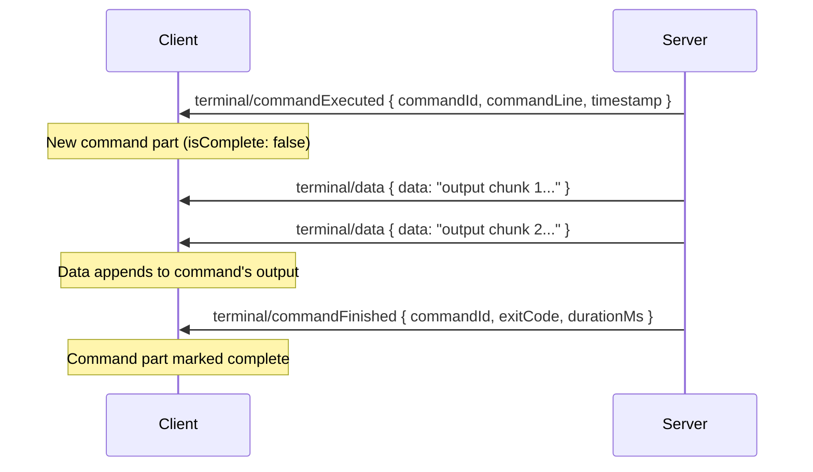
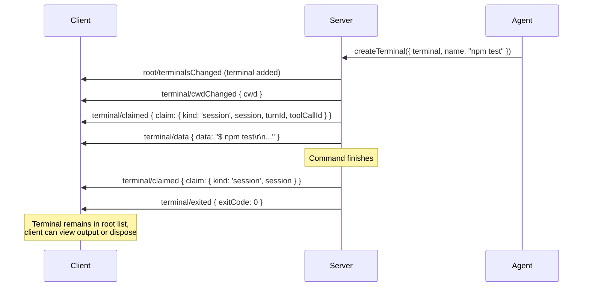
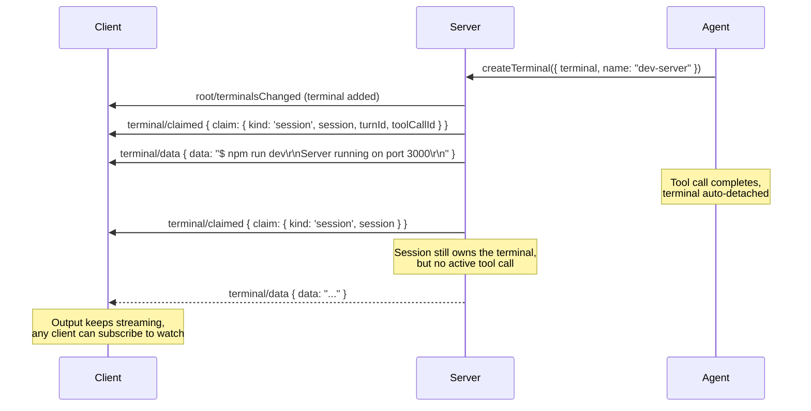
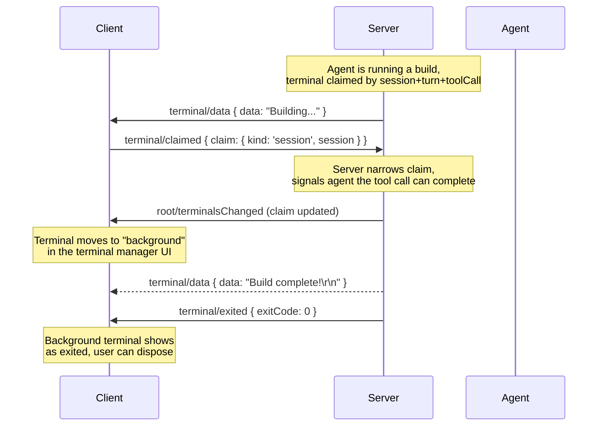
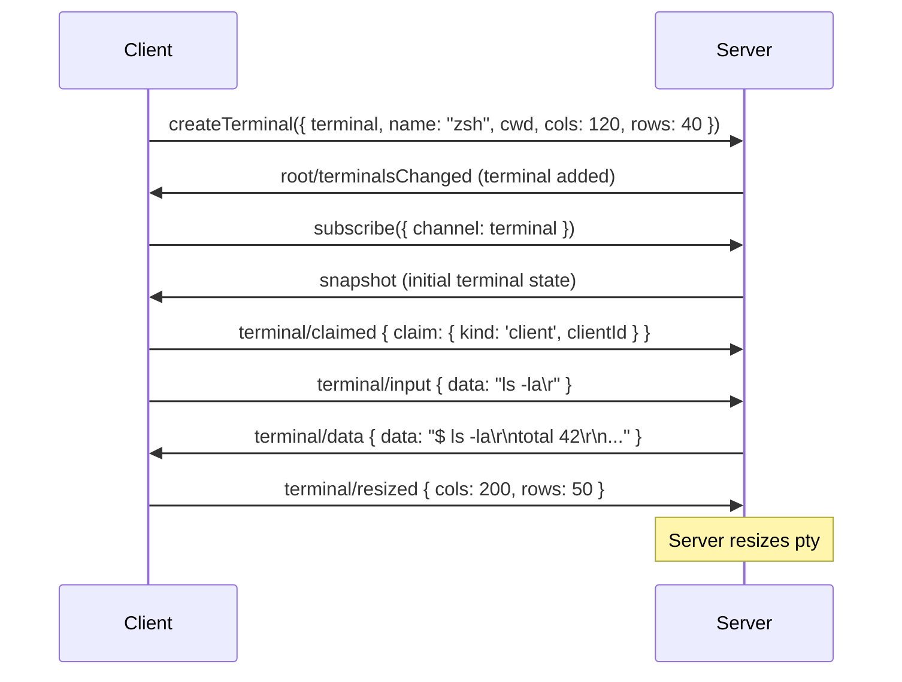
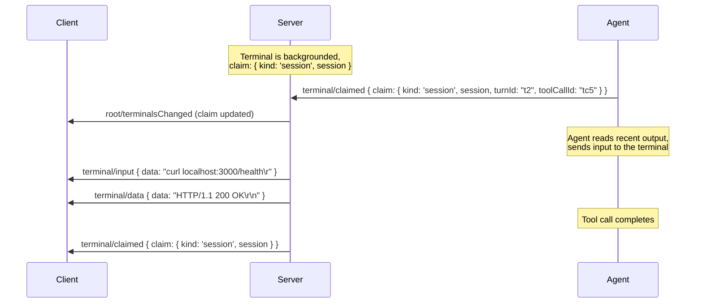
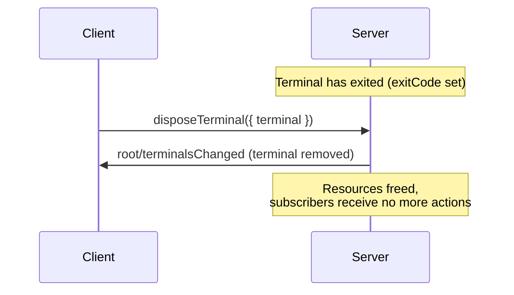

# 終端

終端是 AHP 中一流的可訂閱資源，與根狀態中的工作階段一起存在。它們對偽終端機 (pty) 行程進行建模 - shell 工作階段、dev 伺服器、建置任務 - 代理程式和用戶端可以獨立於任何單一工作階段建立、互動和管理。

## 設計要點

- **終端機有自己的 URI** 並且可以單獨訂閱，就像工作階段一樣。
- **終端機狀態與工作階段狀態是分開的。 ** 終端機獨立於建立它的工作階段而持續存在。
- **透過聲明追蹤所有權。 ** 聲明記錄持有終端機的人：用戶端或工作階段。
- **每個終端機總是擁有的。 ** 不存在無主終端 - `createTerminal` 需要初始聲明，而 `terminal/claimed` 轉移所有權而不是釋放它。

## 終端機狀態

### 根狀態

`ahp-root://` 處的根狀態包含輕量級終端機列表：


```typescript
RootState {
  agents: AgentInfo[]
  activeSessions?: number
  terminals?: TerminalInfo[]
}
```


每個 `TerminalInfo` 都攜帶足夠的元資料來呈現終端機管理器 UI，而無需單獨訂閱每個終端機：


```typescript
TerminalInfo {
  resource: URI             // subscribable terminal URI
  title: string             // human-readable name
  claim: TerminalClaim      // who holds it
  exitCode?: number         // present = process exited
}
```


### 完整終端機狀態

訂閱終端機 URI 提供完整的狀態：


```typescript
TerminalState {
  title: string
  cwd?: URI                 // current working directory
  cols?: number             // width in columns
  rows?: number             // height in rows
  content: TerminalContentPart[]  // structured content parts
  exitCode?: number         // set when process exits
  claim: TerminalClaim      // ownership
  supportsCommandDetection?: boolean  // true when command lifecycle actions are emitted
}
```


`content` 欄位是鍵入內容部分的有序陣列。每個部分要麼是非結構化的終端機輸出，要麼是帶有命令列和輸出的結構化命令：


```typescript
// Raw terminal output (prompts, gaps between commands, etc.)
TerminalUnclassifiedPart {
  type: 'unclassified'
  value: string             // accumulated VT output
}

// A command with its lifecycle metadata
TerminalCommandPart {
  type: 'command'
  commandId: string         // correlates with commandExecuted/commandFinished actions
  commandLine: string       // the command text submitted to the shell
  output: string            // accumulated VT output from the command
  timestamp: number         // Unix ms when execution started (server clock)
  isComplete: boolean       // false while executing, true after commandFinished
  exitCode?: number         // set at completion
  durationMs?: number       // wall-clock duration, set at completion
}
```


只需要原始 VT 流的天真的消費者可以透過以下方式重建它：


```typescript
content.map(p => p.type === 'command' ? p.output : p.value).join('')
```


回滾長度是實作定義的 - 伺服器控制要保留的歷史記錄量。雙方可以獨立修剪其 `content` 以綁定記憶體。

::: info 伺服器-端元資料
代理主機可以維護有關終端機來源的內部元資料 - 例如，知道特定的終端機是作為開發伺服器啟動的，或追蹤啟動它的原始命令。此元資料不是暴露給用戶端的終端機狀態的一部分，但伺服器可以將其暴露給模型，以便在推理終端時為代理提供更豐富的上下文。
:::

## 聲明和所有權

終端機聲明回答「誰在使用此終端機？」使用判別聯集：


```typescript
// A client (e.g. VS Code) interacting directly
TerminalClientClaim {
  kind: 'client'
  clientId: string
}

// A session (e.g. during a tool call)
TerminalSessionClaim {
  kind: 'session'
  session: URI
  turnId?: string           // present when actively used by a tool call
  toolCallId?: string
}
```


工作階段宣告中的 `turnId` 和 `toolCallId` 欄位區分「由工具呼叫主動使用」和「擁有但處於背景」：

|聲明狀態 |意義|
|---|---|
| `{ kind: 'session', session, turnId, toolCallId }` |由正在執行的工具呼叫主動使用 |
| `{ kind: 'session', session }` |有背景，仍歸工作階段 | 所有
| `{ kind: 'client', clientId }` |使用者直接在終端機 UI 中互動 |

每個終端機總是有一個所有者。當不再需要終端機時，應透過 `disposeTerminal` 指令將其處置而不是釋放。

## 終端機操作

終端機操作在終端機的通道上傳播；目標終端機由操作信封的 `channel` 標識，而不是操作本身的欄位。

### 資料流

|行動| 用戶端-可調度 | reducer 效果 |
|---|:---:|---|
| `terminal/data` |沒有 |附加到尾部內容部分 |
| `terminal/input` |是的 |無操作（伺服器轉送到 pty）|

`terminal/data` 只限 **伺服器**：伺服器分派給流向用戶端的 pty 輸出。

當 `terminal/data` 到達時，reducer 將資料附加到最後一個內容部分：
- 如果尾部是不完整的`command`部分，則將資料附加到其`output`。
- 如果尾部是 `unclassified` 部分，則資料將附加到其 `value`。
- 否則，將建立一個新的 `unclassified` 部分。

`terminal/input` 是一個 **僅用戶端、僅副作用的操作**：用戶端調度鍵盤輸入，伺服器將其轉發到 pty 行程。 reducer 不會修改狀態 - 任何結果輸出稍後都會透過 `terminal/data` 到達。

::: 提示為什麼要進行兩個單獨的操作？
終端機 I/O 有意分為 `terminal/input` (用戶端 → pty) 和 `terminal/data` (pty → 用戶端)，因為 **標準預寫入協調對終端並不安全**。 pty 是一個有狀態的、可變的過程－樂觀地應用輸入或預測輸出會產生不正確的狀態。透過將輸入保持為僅副作用操作並將輸出保持為伺服器權威，用戶端可以避免將終端機 I/O 視為正常狀態操作時可能出現的協調陷阱。
:::

### 命令檢測

支援 **shell 整合** 的終端可以報告命令邊界，使用戶端能夠顯示每個命令的狀態裝飾、自動展開/折疊輸出以及保留命令快照。

|行動| 用戶端-可調度 | reducer 效果 |
|---|:---:|---|
| `terminal/commandExecuted` |沒有 |附加 `command` 部分，設定 `supportsCommandDetection` |
| `terminal/commandFinished` |沒有 |將符合的 `command` 部分標記為完整 |

單一指令的生命週期：





伺服器不得在 `terminal/data` 作業中包含 shell 整合轉義序列 — 這些必須在分派之前被刪除。未能剝離它們會導致用戶端上的「具有真實輸出」檢查出現誤報。

用戶端在依賴指令邊界之前必須檢查 `supportsCommandDetection`。如果不存在，所有資料都會流入 `unclassified` 部分，並且沒有可用的命令生命週期。

### 控制

|行動| 用戶端-可調度 | reducer 效果 |
|---|:---:|---|
| `terminal/resized` |是的 |集 `cols`、`rows` |
| `terminal/claimed` |是的 |集`claim` |
| `terminal/titleChanged` |是的 |集`title`|
| `terminal/cwdChanged` |沒有 |集`cwd` |
| `terminal/exited` |沒有 |集`exitCode`|
| `terminal/cleared` |是的 |將 `content` 重設為 `[]` |

根終端機列表由伺服器透過 `root/terminalsChanged` 進行管理，它使用完全替換語義。

## 指令

|命令|方向 |描述 |
|---|---|---|
| `createTerminal` | 用戶端 → 伺服器 |建立一個新的終端機，其中包含必要的初始宣告、可選名稱、cwd 和尺寸 |
| `disposeTerminal` | 用戶端 → 伺服器 |終止行程（如果正在執行）並刪除終端機 |

建立終端機後，用戶端應訂閱其 URI 以接收狀態更新。伺服器調度 `root/terminalsChanged` 以將終端機加到根列表。

## 流量

### 代理程式運行命令

最常見的流程：代理工具呼叫建立終端機、執行指令並傳回結果。





### 代理程式啟動後台伺服器

代理程式啟動一個長時間運行的行程（例如 dev 伺服器）並從中分離，保留工作階段所有權以進行清理。





關鍵細節：聲明範圍從 `{ session, turnId, toolCallId }` 縮小到 `{ session }`。終端機現在是“背景”，但仍與工作階段關聯。

如果稍後處置工作階段，則伺服器可以清除其仍聲明的所有終端。

### 用戶端分離終端機

觀看代理程式運行長時間任務的使用者決定將其分離，以便代理可以繼續運行，但終端機繼續在背景運行。





### 用戶端直接交互

使用者在用戶端 UI 中開啟終端機以供互動式 shell 使用。





### 工作階段回收背景終端機

代理重新與先前後台的終端機互動（例如，檢查開發伺服器的輸出或重新啟動它）。





### 終端機清理

當不再需要終端時將其丟棄。





伺服器也能自動處置終端機－例如，當擁有終端的工作階段被處置時。

## 多種用戶端場景

由於終端是根範圍且可獨立訂閱，因此多個用戶端自然會看到相同的終端機狀態：

- **用戶端 A** 建立一個終端機並與其交互
- **用戶端 B** 訂閱相同的終端機 URI 並看到即時輸出
- **代理**宣告工具呼叫的終端機 - 兩個用戶端都會看到宣告更改
- **代理**撤銷索賠 — 雙方用戶端均看到終端機轉到後台

標準的[預寫入協調](/guide/reconciliation) 機制處理衝突的聲明：如果兩個用戶端嘗試同時聲明相同的終端機，則伺服器接受一個並在操作信封中使用 `rejectionReason` 拒絕另一個。