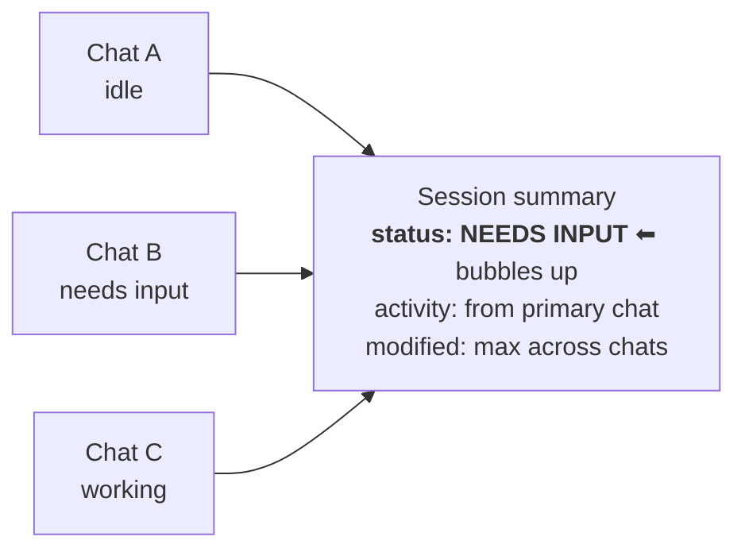
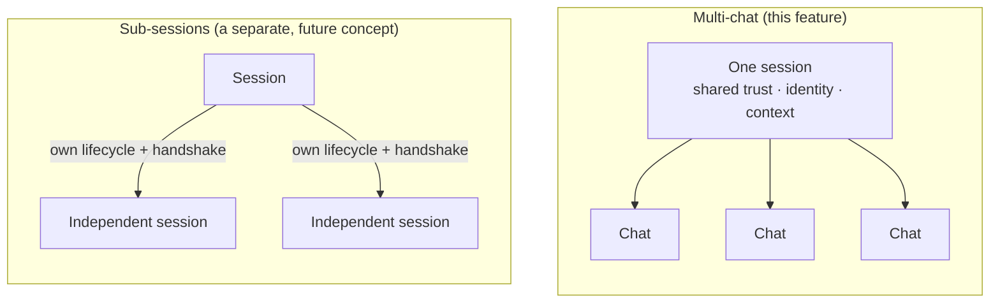
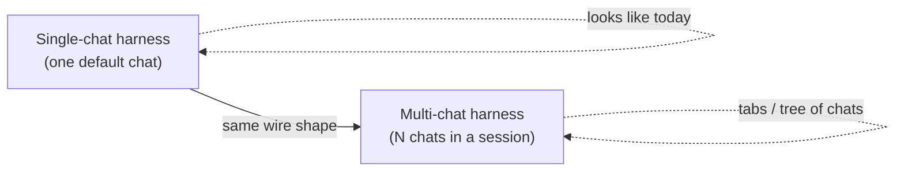
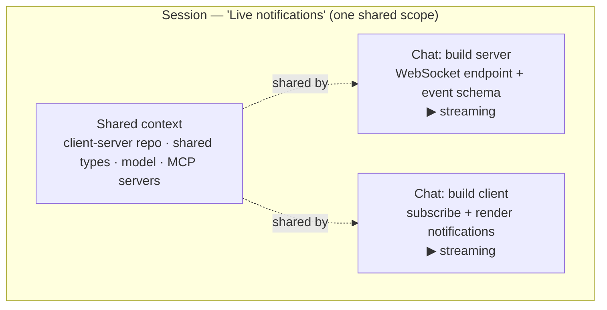
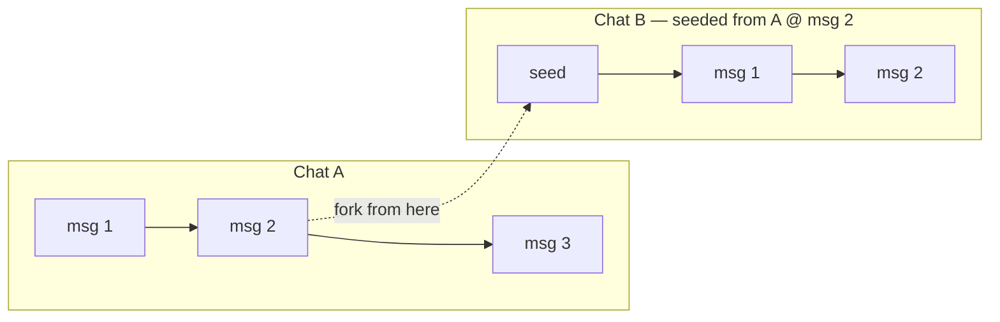
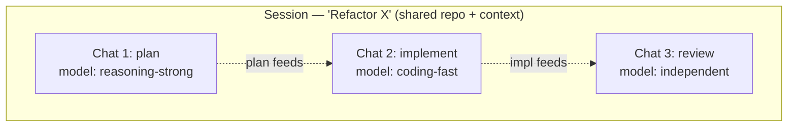
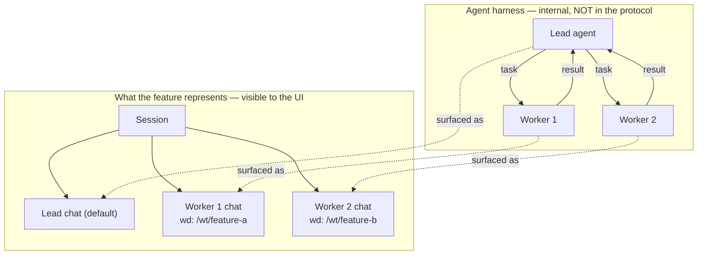
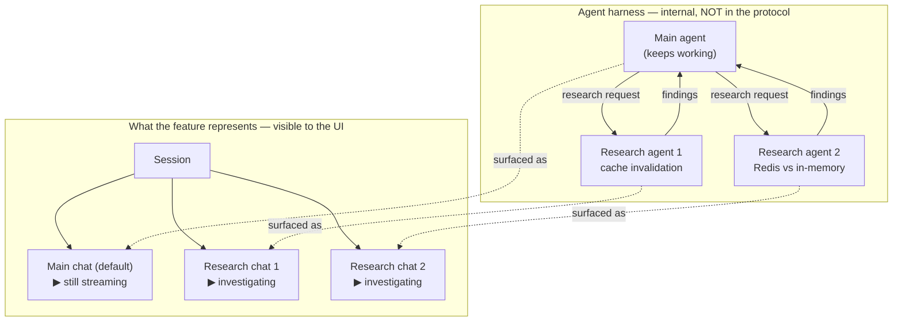
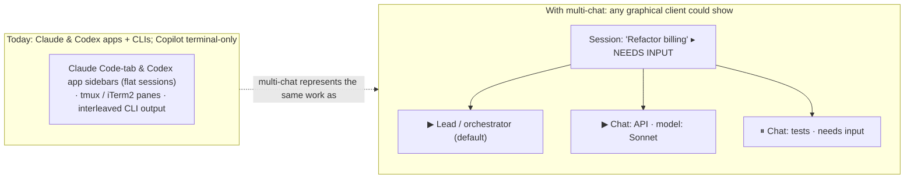

# 工作階段中的多個聊天 — 功能概述

> 用於演示和演示的多聊天功能的概念演練
> 設計討論。本文件故意停留在*功能*層級 -
> 它解釋了**什麼**功能以及**為什麼**它存在，而不需要Go
> 進入協定的具體操作、狀態形狀或線路格式。

---

## 1. 問題

如今的代理人工作階段是**一次單一的線性對話**。工作階段 *是*
聊天：使用者和物件之間的訊息流、工具呼叫和結果
代理。

這種模式與代理產品的發展方向越來越不一致。
現代線束**一次運行多個代理程式**：

- 一個主要代理，將功能分解為子任務並將其分配給工作人員。
- 專業代理「團隊」（審查者、測試編寫者、實作者）
  並行工作。
- 一群工作人員，每個人都在自己的儲存庫簽出中操作。

當單一工作階段只能是一個對話時，使用者介面就沒有
誠實地「展示」這一點。工作要麼被扁平化成一件吵鬧的事情
轉錄本，或它被分割成不相關的工作階段，從而失Go了共享的
上下文（相同的工作空間、相同的專案、相同的配置）。

**一句話中的特徵：**讓單一工作階段包含*多個
共享一個上下文的並發聊天*，以便可以進行多代理工作
作為一個連貫的整體來表示、觀察和互動。

---

## 2.心智模型

轉變是停止將「工作階段」和「對話」視為同一件事，
並將他們分為兩個角色：

- **A 工作階段是協調*範圍*。 ** 它擁有共享的所有內容：
  工作區、專案、預設模型和代理、配置以及
  任何定制。這是信任與認同的邊界——一切
  工作階段裡面是「同一個演員在做同樣的事情」。

- **聊天是在該範圍內的對話*流*。 **每個聊天都是一個
  獨立可追蹤的訊息和活動執行緒。聊天已建立
  並在工作階段的生命週期內刪除，並且每個都可以在
  它自己的。

> 範圍與流是整個想法。一個範圍，多個流。

一個有用的類比：工作階段是一個**專案工作區**，聊天是
**各個工作執行緒**發生在其中。關閉一條線不會撕裂
向下工作區；工作區為每個執行緒提供了共享空間。

---

## 3. 該功能在堆疊中的位置

對於評論家或觀眾來說，這是最重要的框架，因為
它回答了明顯的後續問題（“代理人在哪裡與每個人交談”）
其他？」）在被問到之前。


```
   ┌─────────────┐                         ┌──────────────────────────────┐
   │  UI client  │   ◄── feature layer ──► │   Agent harness              │
   │ (the app a  │    sessions, chats,     │   ── lead agent              │
   │  user sees) │    activity, status     │   ── worker agents   ◄───┐   │
   └─────────────┘                         │   ── task routing /      │   │
                                           │      results (internal) ─┘   │
                                           └──────────────────────────────┘
```


有兩個不同的層，此功能僅涉及其中一層：

- **線束層**是*代​​表實際運作*的地方。產生一個工作者，
  給它一個任務，向它路由一條訊息，並收集它的結果都是
  線束在其自己的運行時內執行的操作。

- **功能/互通性層**（此功能所在的位置）是
  該作品的**視窗**。它的工作是讓使用者介面*代表和
  與*安全帶正在執行的操作進行互動 - 顯示聊天內容、串流傳輸
  活動，並顯示它們的綜合狀態。

**該功能與可觀察性和互動有關，而不是代理運行時。 **
使多代理工作*可見且可用*；它沒有規定代理如何
內部協調。

---

## 4. 該功能為您提供了什麼

在功能層面，多聊天引入了少量功能：

1. **每個工作階段的聊天目錄。 ** 工作階段公開它的聊天集
   目前包含。隨著工作的進行和進展，可以新增和刪除聊天
   下來，每個聊天都帶著一個輕量級摘要（標題、目前狀態、
   最近的活動）。

2. **預設聊天。 ** 一個聊天被指定為「主」執行緒 — 自然的
   放置使用者著陸，並且當沒有更多內容時工作階段指向的後備
   具體適用。

3. **獨立的、可訂閱的串流。 ** 每個聊天都可以單獨關注：
   它的訊息、它的工具呼叫、它的進度。觀看一場聊天不需要
   拉進其他人的噪音。

4. **每個聊天的工作目錄。 ** 每個聊天都可以固定在自己的工作目錄
   目錄。預設情況下，聊天繼承工作階段，但聊天可以覆蓋
   它——這正是不同工作樹中的一群工作人員所需要的。

5. **聚合的工作階段視圖。 ** 工作階段顯示其聊天的總和：
   組合狀態（例如，如果*任何*聊天被阻止，「需要輸入」就會冒泡），
   總體活動和最近修改的時間戳。這讓 UI
   顯示整個工作階段的單一、誠實的摘要晶片。





---

## 5. 工作範例：代理團隊

考慮一個運行“團隊”的安全帶：一個首席代理加上幾個工作人員，
每個都在自己的儲存庫簽出中。

|安全帶的作用是什麼 |該功能如何表示它 |
| --- | --- |
|首席代理商開始 |具有一個預設聊天（潛在客戶）的工作階段。 |
|鉛使兩名工作者旋轉工作階段的目錄中出現兩個新聊天。 |
|每個工作者都有自己的工作樹|每個工作人員聊天都會固定自己的工作目錄。 |
|工作者們記錄進度|每個聊天都會串流自己的活動，可以單獨觀看。 |
|一名工作者陷入困境並需要輸入 | 工作階段摘要匯總為「需要輸入」。 |
|工作者完工後被拆毀 |它的聊天記錄已從目錄中刪除。 |

至關重要的是，**團隊的內部協調永遠不會跨越這一層。 **
領導者告訴工作者要做什麼，工作者傳回其結果，是
駕馭自己的事業。該功能的作用只是讓團隊「看起來」是一個
使用者可以觀看和進入的一組聊天。

這就是為什麼您可以支援完整的代理團隊體驗**，無需任何
協定本身中的聊天到聊天通訊**：通訊已經
發生在安全帶內部的一層下方。

---

## 6. 這個特性*不*是有意為之的

劃定邊界與特徵本身一樣重要。

- **這不是聊天到聊天的訊息傳遞。 ** 沒有用於一次聊天的原語
  向另一個聊天發送訊息或讀取另一個聊天的流。聊天是獨立的
  碰巧共享一個範圍的流。代理之間的協調是一種駕馭
  關心。

- **它不會對代理層次結構進行建模。 ** 該功能沒有
  「領導者與工作者」、「父與子」或作業與工作項目。全部
  聊天是一個工作階段下的對等點。線束可以“使用”它們來代表
  層次結構，但功能保持中立。

- **它不是子工作階段。 ** 多聊天是關於*共享的合作執行緒
  一種信任/認同/背景*。具有自己生命週期的獨立代理
  他們自己的握手完全是一個單獨的概念。

這些遺漏是故意的。更豐富的協調－工作項目、操作、
分配、跨代理訊息傳遞－是一個可以新增的自然*未來*軸
稍後不破壞此功能。多聊天旨在**與**撰寫
那是未來的工作，而不是先發制人。

sub-工作階段的差異值得一張圖片，因為它是最常見的點
的混亂。 *多聊天*是在**一個**身份、信任下合作執行緒，
和背景。 *Sub-工作階段* 是獨立代理，在其上進行身份驗證
擁有並擁有自己的生命週期－一個獨立的、未來的概念：





---

## 7. 為什麼是這個形狀

一些原則推動了設計：

- **代表，而不是編排。 ** 保持可觀察性和互動層。
  一旦該功能開始在代理之間路由訊息，它就不再是一個
  中立視窗並開始成為一個代理框架——這是一個更大的承諾。

- **共享上下文是重點。 ** 這些聊天屬於在一起的原因是
  他們共享一個工作區、一個專案和一個配置。該共享範圍是
  一堆不相關的工作階段永遠無法帶給你什麼。

- **小型、可附加、可組合。 ** 每個功能（目錄、預設、每個聊天）
  工作目錄，總結摘要）是一個小的補充，贏得了它的
  的地方，並為以後更大的協調故事落地留出空間。

- **優雅降級。 ** 此功能向後相容：一種安全帶
  只運行一次對話恰好暴露**一次聊天（預設）**，並且
  這種經驗與今天是一樣的。隨著多智能體的利用變得更加豐富
  行為，它只是在同一個工作階段中點亮*更多聊天* - 有
  沒有什麼可以選擇退出，也沒有什麼中斷。





## 8. 場景 - 以及每個線束如何支援它們

下面的每個場景都配對了一個概念**圖表和現實世界的範例**（
*特徵*形狀，而不是線格式 - 用 Mermaid 編寫，以便它們渲染
GitHub、VS Code 和大多數幻燈片工具）以及 **每個線束如何支援它
今天**。

> **經過文件驗證的快照，仍然是一個移動目標。 ** 下面的映射是
> 根據每個產品的官方文件（2026 年 6 月）進行檢查並引用
> 它們的來源，但線束功能變化很快，有幾個功能正在變化
> 實驗性的。重點是 **模式** — 每個產品的平行代理如何
> 工作映射到功能上—而不是永久的記分卡。

由於此功能會優雅地降級（請參閱第 7 節），因此不會出現任何安全帶「斷裂」的情況 —
唯一的問題是**它點亮了多少個場景，以及 UI 如何顯示
他們。 **

在每種情況下，**“今天的跨線束”**細分涵蓋了每一個
跨**兩個表面 - CLI 和桌面應用程式** - 實時
範例以及它在 UI 中的呈現方式。已根據官方文件進行驗證（已檢查
2026 年 6 月；請參閱[來源](#sources))。有幾個功能是實驗性的
功能變化很快，因此請將其視為當前快照。

**前面的表面註解：** **Claude Code** 和 **Codex** 皆提供圖形
桌面 **應用程式** 及其 CLI，這兩個應用程式驚人地相似：
並行工作階段/執行緒**的左側**側邊欄按您的**儲存庫/資料夾分組
打開—不是透過工作樹**。每個工作階段仍然有自己的工作樹，但是
側邊欄列出了**儲存庫中所有功能**中的每個工作階段作為 **平面
列表**，因此不相關的功能與沒有每個功能組的交錯（
CLI 的「`cd` 進入功能工作樹以限制其聊天範圍」慣用法不包含
結束）。這些應用程式也提供 **per-工作階段 Git-worktree 隔離**，**分割
view** 一次看到兩個工作階段，並且可排列 **diff / 預覽 / 終端機 /
子代理窗格**。 **GitHub Copilot CLI** 僅*終端機*適用於這項工作（其
圖形介面是獨立的、較粗糙的 VS Code 編碼代理）。兩個應用程式都沒有，不過，將平行工作建模為**一個具有匯總狀態的共享工作階段
跨同行**－他們並排列出獨立的工作階段。

### 8.1 在一個情境中使用者驅動的平行工作

最常見的日常情況，它**由使用者驅動，而不是代理**：
人們故意在「同一」共享上下文中開啟多個聊天來推送
一項工作向前推進。這裡匯集了三件事—聊天**分享一件事
範圍**（工作空間、模型、配置），它們可以**同時串流**，並且它們
在 UI 中保持**分組在一個工作階段** 下。沒有代理生成任何東西；的
人類正在整理執行緒。

> **真實範例：** 開發人員正在 `client-server` monorepo 中工作
> 同時包含後端服務和前端用戶端，以及模型和
> 專案的 MCP 伺服器在工作階段層級配置過一次。為了建立一個新的
> 端到端的「即時通知」功能，他們自己打開兩個聊天 - 一對一
> *建置伺服器*（新增 WebSocket 端點和事件架構），並將其一
> *建構用戶端* （訂閱套接字並呈現通知）。兩者都
> 聊天看到相同的簽出分支、相同的共享類型和相同的 lint
> 配置（共享上下文）。他們有伺服器聊天支架端點，同時
> 他們同時根據商定的事件形狀進行用戶端聊天
>（並發）。第二天早上，他們重新打開了一個工作階段和兩個執行緒 —
> 伺服器和用戶端 — 仍然分組在一起（分組），而不是狩獵> 透過不相關的歷史來重新組合該功能。





**今天的安全帶：**

**克勞德·代碼**
- **CLI：** 透過一個工作區上的 *named 工作階段* 支援 — `claude -n
  auth-refactor` (or `/rename`), switched through the `/resume` 選擇器（
  終端機 TUI，列出每個專案的每個工作階段，帶有工作樹/所有項目
  透過 Ctrl+W / Ctrl+A 擴大）。注意：將 *相同* 工作階段分成兩份
  終端交錯兩個轉錄本，因此真正的平行執行緒需要
  fork（參見 8.2）或單獨命名為工作階段。
- **桌面應用程式：** 支援且圖形化 — **程式碼標籤** 列出您的工作階段
  在側邊欄中並並行運行多個；對於 Git 儲存庫 **每個工作階段都有其
  擁有獨立的工作樹**，並且 **Cmd-click** 並排打開兩個工作階段
  （分割視圖）。工作階段依您開啟的專案資料夾分組。
- **即時範例：** 開發人員在一個終端機中開啟 `claude -n api`，並且
  `claude -n tests` 在同一個儲存庫的另一個中，規劃兩個獨立的
  執行緒並排。- **UI:** 終端機 — `/resume` 工作階段-選擇器列表，或多個終端機
  Windows / tmux 窗格。桌面 — 並行工作階段的程式碼標籤側邊欄
  具有分割視圖。

**Codex**
- **CLI:** 一個主執行緒，但 `/new` 在同一個主執行緒中開始新的對話
  process 和 `/agent` 在活動執行緒之間切換。
- **桌面應用程式：** 支援和圖形化 — 該應用程式按*專案*組織工作
  並一次運行多個執行緒，每個**本地**（前台）或在一個
  隔離的 Git **工作樹**；側邊欄列出了每個專案的執行緒。雲
  `chatgpt.com/codex` 處的檢視將排隊/活動任務顯示為卡片。
- **即時範例：** 在 Codex 應用程式中，開發人員開啟專案並啟動
  三個執行緒——工作樹重構、測試通過和文件更新——全部
  在側邊欄中可見並並行串流。
- **UI：**圖形應用程式側邊欄（每個專案執行緒清單）+雲端任務卡；
  CLI = 透過 `/agent` 進行執行緒切換。

**GitHub Copilot CLI**
- **CLI:** 部分 — 您可以在多個終端機實例中執行 `copilot`
  相同的工作區，並且 `/resume` 選擇器在已儲存的工作階段之間切換，但是
  一次只有一個**（沒有實時 in-工作階段執行緒切換）。 `copilot --cloud`
  列出「並行運行多個任務」作為用例。
- **桌面應用程式：** 對於 CLI 不適用 — 僅終端機。
- **即時範例：** 開發人員在同一個選項卡的兩個終端機選項卡中執行 `copilot`
  repo 同時向前推進兩個執行緒。
- **UI:** 終端機 — 多個視窗，或 `/resume` 工作階段選擇器。

#### 使用者介面的外觀

**Claude Code — CLI**（當今使用者並行使用某個功能的方式是
**建立一個名為 git 工作樹的功能並為每個工作樹開啟一個工作階段
在其中工作** — Claude 按目錄將工作階段分組，因此工作樹*是*
特點）：


```text
 $ git worktree add ../live-notifications   # the feature
 $ cd ../live-notifications
 Terminal A                         │  Terminal B
 $ claude -n build-server           │  $ claude -n build-client
  ● build-server   ▶ streaming      │   ● build-client   ▶ streaming
  > add WebSocket endpoint…         │   > subscribe + render notifs…
 ───────────────── /resume picker ─────────────────
  ▾ ~/code/live-notifications   ← the feature (worktree)
      ├ build-server   ▶ in progress
      └ build-client   ▶ in progress
```


> 這是真正的、慣用的流程－工作樹目錄就是你如何命名一個
> 功能並將其並行聊天保持在一起。它的一個限制是：分組是
> *目錄*，不是一個工作階段物件，因此沒有滾動的狀態/標題
> 聊天，工作樹軸現在用於分組（你不能也給出
> 每個聊天都有其*自己的*工作樹 - 8.4 情況）。 AHP 保持相同的模式，但是
> 分隔軸： **`session`** 是功能（共享範圍 +
> 捲起狀態）； **`workingDirectory`** （根據工作階段，可選擇覆蓋
> 每個聊天）是檔案系統 - 因此您分組*並且*仍然可以隔離聊天。

**Claude Code — 桌面應用程式**（**Code 選項卡**將工作階段按
**您打開的儲存庫/資料夾 - 不是透過工作樹**。每個工作階段仍然擁有它的*自己的*
自動建立的工作樹，但側邊欄列出了倉庫中的**每個工作階段
所有功能**作為一個**平面列表**，因此 CLI 的功能分組習慣用法 — `cd`
進入功能工作樹以限制其聊天範圍 - 不會延續；無關的
功能是交錯的，沒有每個功能組，也沒有匯總狀態）：


```text
 ┌ Claude — Code tab · repo: myapp ─────────────────┐
 │ Sessions (ALL features in repo) │  build-server   │
 │   ● build-server   ▶ wt#1       │  ▶ streaming…   │
 │   ● build-client   ▶ wt#2       │  ── diff ──     │
 │   ● fix-login-bug  ▶ wt#3       │  + server.ts    │  ← other
 │   ● bump-deps      idle         │                 │     features
 └─────────────────────────────────┴─────────────────┘
   grouped by REPO, not feature · all features mixed · per-session worktrees
```


**Codex — CLI**（相同的慣用語 — 名為工作樹的功能具有平行性
執行緒； `/agent` 在它們之間切換，`/new` 打開另一個）：


```text
 $ git worktree add ../live-notifications && cd ../live-notifications
 codex › /agent
  active threads (in this feature worktree) ───────
  1 ● build-server   ▶ running
  2 ○ build-client   idle
  switch 1–2  ·  /new = another thread in this feature
```


**Codex — 桌面應用程式**（同一個故事 — 應用程式按 **repo/資料夾將執行緒分組
你打開，不是透過工作樹**。打開儲存庫，您會看到**所線路程中的每個執行緒
功能**在一個**平面列表中**；工作樹只是每個執行緒*運行*位置，
從來不是分組節點 - 因此沒有每個功能組，也沒有匯總狀態）：


```text
 ┌ Codex app · repo: myapp ────────────────────────┐
 │ Threads (ALL features in repo)  │  build-server │
 │   ● build-server   ▶ wt#1       │  ▶ streaming… │
 │   ● build-client   ▶ wt#2       │  [review pane]│
 │   ● fix-login-bug  ▶ wt#3       │               │  ← other
 │   ● bump-deps      idle         │               │     features
 └─────────────────────────────────┴───────────────┘
   grouped by REPO, not feature · all features mixed in one list
```


**GitHub Copilot CLI — CLI** （相同的習慣用法 — 建立功能工作樹，然後執行
每件作品一個`copilot`； `/resume` 一次重新打開一個）：


```text
 $ git worktree add ../live-notifications && cd ../live-notifications
 Terminal 1: $ copilot              Terminal 2: $ copilot
  > build the server endpoint        > build the client subscriber
  ● working…                         ● working…
 (desktop app: N/A — terminal-only)
```


### 8.2 分岔與側聊

新的聊天是從現有聊天中的一個點分叉出來的，並以該歷史記錄為種子，
然後自行發散。兩個聊天都繼續分享工作階段的上下文。

**fork** 使用 `{ kind: "fork", chat, turnId }` 複製可見歷史記錄
透過一個完整的來源變成一個新的聊天。 **邊聊**使用
`{ kind: "sideChat", chat, turnId, selection? }`。樓主解決了
穩定 `turnId` 對抗已完成的回合或父級當前的活動
在建立時轉動，但線路不會快照哪個生命週期槽持有
它。如果 id 指定了活動輪次，則主機會快照任何回應
在那一刻可用。當存在 `selection` 時，主機也會記錄一個
使用者確切選擇的不可變 `{ text, responsePartId? }` 快照
文字； `text` 必須非空，且 `responsePartId` 僅是出處，而非
範圍。這保留了 `/btw` 式的附帶問題，而無需複製父級的回合
進入自己的轉錄本。它是一個專注、
獨立對話，稍後可以作為主聊天拉回
有界聊天附件。這種區別保持了側面記錄的乾淨，同時
使結果持久且可重複使用：

|模式|來源上下文 |新聊天的可見歷史記錄 |返迴路徑 |
| --- | --- | --- | --- |
|叉|透過原始碼轉複製|從複製的父回合開始 |繼續任一分支 |
|側聊 |透過來源 `turnId` 提供（根據建立時的歷史或活動輪次進行解析）|開始為空 |透過完成的側聊回合進行附加 |

代理人透過 `multipleChats.fork` 獨立宣傳這些內容，並且
`multipleChats.sideChat`，因此用戶端僅提供所選的建立模式
代理支援。

> **真實世界的範例：** 偵錯中期，在訊息 12 處，代理人提出了兩個
> 修復競爭條件。開發人員不會缺少當前執行緒，而是
> 分叉一個新的聊天*從訊息 12* 中播種*以嘗試方法 B（重寫路徑
> 圍繞隊列），而原始聊天仍然保留方法 A。兩個分叉
> 共享相同的儲存庫和配置；開發人員比較兩個結果並
> 保留獲勝者。





**今天的安全帶：**

**克勞德·代碼**
- **CLI:** 支援 — `/branch [name]` 複製到目前為止的對話並
  將您切換到它（原始保留，可透過 `/resume` 恢復）；
  `claude --continue --fork-session` 從命令列執行相同的操作；裡面
  `/btw` 覆蓋，`f` 分叉一個新的工作階段繼承父轉錄物加上
  那個問答。與倒帶/檢查點 (Esc-Esc) 不同，後者編輯*相同*
  執行緒。
- **桌面應用程式：** 支援 - 程式碼標籤具有 **側面聊天** (`Cmd+;`)：側面
  重複使用工作階段上下文而不破壞主執行緒的問題 —
  實際上是一個輕量級的應用內分支。 **完整的分叉作為扁平兄弟落地**
  工作階段在倉庫清單中（在它自己的工作樹中）；與 CLI 的 `/resume` 樹不同，
  父↔叉關係**未**顯示在側邊欄。
- **即時範例：** 訊息 12 處的調試中期，開發運行
  `/branch approach-b` 在原始執行緒保持不變的情況下嘗試替代修復
  完好無損。- **UI:** 終端機 — 分叉分組在 `/resume` 中的根工作階段下
  選擇器（以 `→` 擴充）。桌面版 — 在工作階段旁邊開啟一個側邊聊天視窗，或者
  在扁平側邊欄中分叉**同級** 工作階段（無分叉樹）。

**Codex**
- **CLI：** 支援，多種方式 - `/fork` 將目前對話複製到
  一個新執行緒（新 ID，原始未更改）；按 **Esc 兩次，然後按 Enter**
  從您傳回的較早訊息中分叉；`/side`（別名 `/btw`）打開
  一個臨時側分支，同時仍然顯示父執行緒的狀態；
  `codex fork` 從選擇器分叉*已儲存的* 工作階段。
- **桌面應用程式：** 在儲存庫的平面執行緒中分叉表面為**新執行緒**
  列表 - **總是作為同級**，從不巢狀在父項下。Codex不同於
  克勞德在 *fork 運行的地方*：新執行緒撰寫器讓它留在
  **相同的工作樹**，採用新的**工作樹**，或轉到**雲** - 但是
  無論哪種方式，執行緒都是平面同級，因此不會顯示父級↔fork 連結。
- **即時範例：** 開發人員按 Esc 兩次回到訊息 12 並
  按 Enter 分叉「方法 B」；原始記錄被保留。
- **使用者介面：** 終端機 CLI；在應用程式中，分叉是一個新的同級執行緒條目（沒有分叉
  樹）。

**GitHub Copilot CLI**
- **CLI：** 不支援 — 沒有分叉/分支概念。 `/clear` 重新開始
  沒有種子歷史記錄，`/resume` 回到過去的工作階段但無法分支
  它。
- **桌面應用程式：** N/A。
- **即時範例：** 無 — 最接近的解決方法是啟動新的工作階段
  並手動重新建立上下文。
- **使用者介面：** 不適用。

#### 使用者介面的外觀

**克勞德代碼 - CLI**（`/branch` 複製對話並顯示分叉
巢狀在 `/resume` 的根下；因為兩個分叉然後**編輯文件**，你
通常每個都有自己的**工作樹**，因此方法 A 和方法 B 不會
互相毆打）：


```text
 $ git worktree add ../approach-b   # isolate the fork's edits
 claude › /branch approach-b
   ✓ copied conversation @ msg 12 → "approach-b"  (original intact)
 ───────────────── /resume picker ─────────────────
   ▾ debug-race-condition
       ├ approach-a   ▶  (wd: ./)            ◀ edits here
       └ approach-b   ▶  (wd: ../approach-b) ◀ isolated edits
```


**Claude Code — 桌面應用程式**（與 CLI 的 `/resume` 樹不同，這裡的一個分支是
**始終建立為平面同級** 工作階段在儲存庫的工作階段清單中 - 它是
*不*巢狀在其父項下，因此父項↔fork關係在
側邊欄。 `Cmd+;` **側聊天**是唯一保持附加狀態的就地分支
到工作階段的上下文）：


```text
 ┌ Claude — Code tab · repo: myapp ─┬ side chat (Cmd+;) ─┐
 │ Sessions (flat — no fork tree)   │ "try approach-b…"  │
 │   ● debug-race    ▶ msg 12       │ uses session ctx,  │
 │   ● approach-b    ▶ wt#2         │ main thread intact │
 │     (fork — sibling, NOT nested) │                    │
 └──────────────────────────────────┴────────────────────┘
   fork = new sibling session · parent/fork link not shown in sidebar
```


**Codex — CLI**（`/fork` 克隆執行緒；Esc-Esc 回到然後 Enter forks；
`/side` 是一個暫存分支）：


```text
 codex › (Esc Esc → walk back to msg 12) … Enter = fork from here
 codex › /fork
   ✓ cloned thread → new id   (original transcript untouched)
   /side = ephemeral side branch (parent status still shown)
```


**Codex — 桌面應用程式**（新執行緒撰寫器選擇 *fork 運行的位置* —
相同/本地工作樹，一個新的獨立的**工作樹**，或一個**雲**任務 - 但
產生的執行緒**總是儲存庫清單中的平面同級**，而不是巢狀的）：


```text
 ┌ New thread ─────────────────────────┐     repo: myapp (flat list)
 │ Fork from: debug-race @ msg 12       │       ● debug-race  ▶
 │ Run as:  (•) Local (same worktree)   │  →    ● approach-b  ▶  ← sibling,
 │          ( ) Worktree  ← new dir     │         (fork, NOT nested)
 │          ( ) Cloud task              │
 └──────────────────────────────────────┘
```


**GitHub Copilot CLI** — **不支援**；沒有分叉/分支。 `/clear`
只是重新開始，沒有種子歷史。（桌面應用程式：不適用。）


```text
 copilot › /clear        ✗ starts over — cannot branch from a point
```


### 8.3 在計畫→建構→審查管道中混合模型

另一個使用者驅動的案例：開發人員透過
聊天序列，每個固定到一個**不同的模型**，選擇它的好處
at — 並且可以繼續**並行迭代所有三個**，因為每個聊天都包含
只有它自己的上下文。工作階段共享儲存庫；每個聊天都會選擇自己的模型
並保持自己乾淨的歷史。

> **真實世界的範例：** 開發人員希望進行仔細、高風險的重構
> 對。在聊天 1 中，他們要求一個強大的推理模型來「提出計劃」——
> 將重構分解為步驟並標記有風險的部分。在聊天 2 中，他們遞出了
> 規劃一個快速編碼最佳化模型來*實作它*。在聊天 3 中，他們固定了
> 第三，獨立模型以新的眼光*審查實作* - 否
> 附加到實作者所做的選擇。所有三個聊天都有相同的內容
> 倉庫和分支；每個聊天中只有模型不同，因此每個階段都使用該模型
> 最適合它並且評論保持真正的獨立性。
>
> 因為每個階段都有自己的聊天，所以開發人員可以**迭代所有三個階段
> 並行而不污染彼此的上下文**：完善聊天 1 中的計劃，
> 在聊天 2 中推送修復，並在聊天 3 中重新運行審核 - 每個對話都會保留> 僅與*其*工作相關的歷史記錄。規劃模型從來沒有噪音
> 實作記錄轉儲到其上下文中，而審閱者從未
> 繼承實作者的合理化，因此每個階段都保持重點和
> 即使工作反覆進行，評審也保持公正。





**今天的安全帶：**

**克勞德·代碼**
- **CLI:** 支援 — `/model` 設定目前工作階段的模型，並在
  代理團隊的每個隊友都可以運行不同的模型（“為每個團隊使用 Sonnet”）
  隊友」；**`/config` 中的預設隊友模型**）。使用者驅動的三階段
  管道被手動組裝為單獨的工作階段，每個都有自己的
  `/model`。
- **桌面應用程式：** 支援 - 每個工作階段旁邊都有一個 **模型選擇器**
  發送按鈕（`Cmd+Shift+I`），可變更中間工作階段，因此每個平行工作階段
  可以運行不同的模型。
- **即時範例：** Opus 上的規劃工作階段，Opus 上的實作者隊友
  Sonnet，以及另一個模型上的第三個獨立的工作階段供審查 - 每個
  透過 `/model` 固定。
- **UI:** 終端機 — `/model` 選擇器與 `/config` 預設隊友模型
  設定。桌面版 — 每工作階段模型選擇器。

**Codex**
- **CLI：** 支援 — `/model` 在啟動時在工作階段、`--model gpt-5.5` 中間切換，
  每個子代理的 TOML 都可以固定自己的 `model` / `model_reasoning_effort`。
- **桌面應用程式/IDE：** 支援 - 模型切換器直接位於聊天下方
  輸入，每個執行緒可切換。 **雲端任務是差距**：它們被固定到
  GPT-5.3-Codex 沒有針對每個任務的模型選擇（因此總體*部分*）。
- **即時範例：** GPT-5.5 上的計畫執行緒，GPT-5.5 上的實作執行緒
  GPT-5.3-Codex，以及不同模型上的審核執行緒 - 透過 `/model` 設定或
  應用程式的切換器。
- **使用者介面：** CLI `/model`；輸入下的應用程式/IDE 切換器。

**GitHub Copilot CLI**
- **CLI：** 支援 — 在一個 `/fleet` 提示中，您可以為每個子任務指派模型
  （“*使用 GPT-5.3-Codex 建立…使用 Claude Opus 4.5 分析…*”），以及
  `@custom-agent` 設定檔帶有自己的固定模型（否則子代理
  預設為低成本型號）。
- **桌面應用程式：** N/A — 僅終端機。
- **即時範例：** 一個 `/fleet` 提示將設計審核路由至 Opus 和
  在同一運行中產生 GPT-5.3-Codex 的程式碼。
- **UI:** 終端機 — 模型選擇內嵌寫入提示中。

#### 使用者介面的外觀

**Claude Code — CLI**（`/model` per 工作階段；隊友的預設模型
`/config`。所有三個階段**共享一個工作目錄** - 審查必須看到什麼
產生的建置 - 所以這裡*沒有*每個聊天工作樹，與 8.2/8.4 不同）：


```text
 # all in the same feature worktree — shared wd
 chat 1 (plan)      claude › /model opus      (wd: ./)
 chat 2 (build)     claude › /model sonnet    (wd: ./)
 chat 3 (review)    claude › /model …         (wd: ./)   ← sees build's edits
 /config › Default teammate model: Haiku
```


**Codex — CLI**（`/model` mid-工作階段；TOML 中的每個子代理程式模型）。 **桌面版
app:** 每個執行緒的模型切換器位於聊天輸入下方。 **雲端任務是
差距** — 固定在 GPT-5.3-Codex：


```text
 codex › /model gpt-5.5         (plan thread)
 codex › /model gpt-5.3-codex   (build thread)
 app: ⌄ model switcher under composer · cloud task = gpt-5.3-codex (fixed)
```


**GitHub Copilot CLI**（在一個 `/fleet` 提示內為每個子任務分配的模型；
桌面應用程式：不適用）：


```text
 copilot › /fleet  "…Use gpt-5.3-codex to create… Use Opus 4.5 to review…"
   ├─ subagent A · model: gpt-5.3-codex  ▶
   └─ subagent B · model: opus-4.5       ▶
```


### 8.4 任務分解－代理團隊

8.1 是“使用者驅動”，而本例是“代理驅動”：線束本身
啟動聊天以並行化工作。關鍵的見解是**兩層** -
線束運行代理並在內部路由它們之間的工作；僅此功能
*代表*每個代理作為使用者可以觀看和進入的聊天。

> **真實範例：** 產品經理檔案“從伺服器遷移身份驗證”
> 工作階段到 JWT。」主導代理人將其分解並啟動三個工作人員：
>worker 1重寫後端中間件（工作樹A），worker 2遷移
> 用戶端 SDK（工作樹 B），工作人員 3 撰寫遷移指南。開發商
> 並行監視所有三個流，並在工作執行緒 2 詢問哪個流時解除阻塞
> 使用令牌刷新策略－永遠不要碰其他兩個。





請注意**任務/結果箭頭如何完全位於線束盒內** - 它們
永遠不要跨入要素圖層。這正是為什麼代理商團隊不需要
協定中的聊天間通訊。

**今天的安全帶：**

**Claude Code** — *最豐富的案例，也是此功能的激勵案例。 *
- **CLI：** 透過**代理團隊**完全支援：領導者產生隊友（每個人
  完整的克勞德代碼實例及其自己的上下文），透過共享協調
  **任務清單**（待處理/進行中/已完成、依賴項、檔案鎖定
  聲稱）和用於直接代理到代理訊息傳遞的**郵箱**，以及
  每個隊友的模型，計劃批准握手，以及優雅的關閉。
  **實驗性**（`CLAUDE_CODE_EXPERIMENTAL_AGENT_TEAMS=1`，v2.1.32+）。
- **桌面應用程式：** **不支援 Agent Teams** — 實驗性對等團隊
  功能（領導者 + 隊友、共享任務清單、郵箱）**僅限 CLI**。守則
  選項卡確實有用於普通子代理程式/計劃活動的 `tasks` 和 `subagent` 窗格，
  但它不會運行或呈現代理團隊。在終端機最接近的
  「儀表板」是**分割窗格模式**（tmux / iTerm2，每個隊友都有自己的窗格）或**行程內模式**（Shift+向下鍵循環，Ctrl+T 循環任務清單）。
- **即時範例：**「重構計費模組」→ 領導者產生一個 API
  **在 CLI** 中的隊友和測試隊友，每個都有自己的上下文；所有三個
  並行運行，並在開發週期中暫停以做出計劃批准決定
  使用 Shift+Down 瀏覽它們。
- **UI:** 終端機僅適用於團隊 — Shift+向下分頁或 tmux 分割窗格，加上
  Ctrl+T 任務清單（桌面應用程式中沒有座席團隊視圖）。

**Codex**
- **CLI:** 部分 — Codex 透過 **精心安排的子代理進行並行化
  扇出**（內建 `default` / `worker` / `explorer` 角色以及自訂 TOML
  代理，`max_threads` 預設為 6)，但父級協調並
  收集結果； **沒有點對點訊息傳遞或共享任務清單**，
  所以這會分解為 8.5 而不是真正的團隊。
- **桌面應用程式：** **無代理團隊支援** — 子代理程式扇出是
  CLI/設定功能；桌面應用程式組織獨立的**執行緒**，而不是
  領導者加隊友組隊，表面上沒有任何團隊配合。
- **即時範例：** 主執行緒產生 `worker` 和 `explorer`
  **來自 CLI** 的平行子代理；他們完成並報告回來，從來沒有
  互相交談。
- **UI:** CLI — 內嵌顯示子代理程式活動；不是一個同儕團隊，也不是一個
  應用程式中的代理團隊視圖。

**GitHub Copilot CLI**
- **CLI:** 部分 — `/fleet` 使主代理程式成為一個破壞的 **協調器**
  將計劃分解為獨立的子任務，並將它們作為平行子代理程式運行
  依賴管理；結果報告回來（沒有同儕訊息傳遞），所以這又是
  是扇出的，而不是對等團隊。
- **桌面應用程式：** N/A — 僅終端機。
- **即時範例：** 在計劃模式下，開發人員選擇「接受計劃並構建
  autopilot + /fleet，”並且編排器扇出測試/模組重構/
  並行文件子代理程式。
- **UI:** 終端機 — CLI 回應時間軸中的子代理進度。

#### 使用者介面的外觀

**Claude Code — CLI，行程內模式**（Shift+Down 循環隊友；Ctrl+T
切換共享任務清單）：


```text
 ● lead  — "refactor billing"                 [Ctrl+T task list]
   Shift+Down ▾ cycle teammates
   ├ ▶ api-teammate     rewriting endpoints
   └ ⏸ tests-teammate   waiting on plan approval
 ── task list ──  pending │ in-progress │ done   (file-locked claim)
```


**Claude Code — CLI，分割窗格模式**（tmux / iTerm2 — 最接近
“儀表板”，但仍然是終端機窗格；每個同時寫作的隊友
在其**自己的工作樹**中運行，因此並行編輯保持隔離）：


```text
 ┌ lead ──────────┬ api-teammate ───┐
 │ assigns tasks  │ ▶ writing API   │  wd: ../wt/api
 ├────────────────┼─────────────────┤
 │ task list ✓✓▶  │ tests-teammate  │  wd: ../wt/tests
 │                │ ⏸ plan approval │
 └────────────────┴─────────────────┘   tmux / iTerm2 panes
   each writing teammate = its own worktree (isolated working dir)
```


**Claude Code — 桌面應用程式**（**Agent Teams 此處不可用** — 程式碼
選項卡運行獨立的工作階段和 `tasks` / `subagent` 窗格，但
領導者加隊友團隊僅存在於 CLI 中；管理你留在的團隊
終端機）：


```text
 ┌ Claude — Code tab ────────────┬ tasks ───────────┐
 │ ● refactor-billing  ▶         │ ✓ middleware     │
 │   (ordinary session +         │ ▶ client SDK     │
 │    subagent/plan panes)       │ ⏸ migration guide│
 │ ✗ no lead/teammate agent team │                  │
 └───────────────────────────────┴──────────────────┘
   agent teams = CLI only · the app shows sessions, not a team
```


**Codex — CLI**（精心策劃的扇出 — 父代理生成子代理，沒有對等代理
訊息傳遞）：


```text
 codex › spawn worker + explorer
   ├ worker    ▶ implement middleware
   └ explorer  ▶ read existing auth flow
   (parent collects results; agents don't talk to each other)
```


**Codex — 桌面應用程式**（側邊欄按 **repo/folder** 分組 — 執行緒是
**同級的平面列表**，不由工作樹巢狀；每個執行緒都可以*運行*其
擁有獨立的 Git **worktree**，但這是每個執行緒的隔離屬性，而不是
分組軸）：


```text
 ┌ Codex app ───────────────────────────────────┐
 │ Project: billing     │  worker · run: wt/feat-a│
 │   ● worker   ▶       │  ▶ editing files        │
 │   ● explorer ▶       │  ── git diff ──         │
 │  (flat siblings)     │  + middleware.ts        │
 └──────────────────────┴──────────────────────────┘
   worktree = per-thread isolation (a run attribute), not a sidebar group
```


**GitHub Copilot CLI**（`/fleet` 編排器透過依賴項扇出計劃
管理；桌面應用程式：不適用）：


```text
 copilot › ⇧⇥ plan → "Accept plan and build on autopilot + /fleet"
   orchestrator ▸ fan-out
   ├ subagent 1  ▶ backend middleware
   ├ subagent 2  ▶ client SDK
   └ subagent 3  ▶ migration guide      (results report back)
```


### 8.5 代理驅動的平行研究（扇出，然後繼續）

第二種代理驅動模式：主要代理不會移交「整個」工作 -
它繼續負責，但**派遣平行研究人員**進行調查
附帶問題，同時繼續處理自己的執行緒，並折疊他們的
當他們回來時發現的結果。每個平行研究人員都以其
自己的聊天，這樣使用者就可以在主要工作的同時觀看研究的進行。

> **真實世界範例：** 主要代理正在實作快取層。而是
> 與阻止相比，它同時啟動兩個研究代理——其中一個負責*調查
> 程式碼庫目前如何讓快取失效*，另一個*比較 Redis 與 Redis
> 此工作負載的記憶體中權衡*。當他們挖掘時，主要代理一直在
> 搭建介面。每位研究人員都會加入自己的聊天室；作為每個
> 傳回其摘要，主要代理合併答案並繼續。的
> 使用者看到三個即時聊天 - 主要實作加上兩個短暫的
> 研究線索－並且可以窺探研究者的推理，而無需
> 中斷主要工作。





與 8.4 的區別：鉛**分解並移交**工作；這裡
主要代理**仍然是驅動程式**並且只扇出*研究*，繼續其
自己的執行緒，不阻塞。兩者都只是一個工作階段下的多個聊天 —
請求/結果路由保留在線束內。

**今天的安全帶：**

**克勞德·代碼**
- **CLI：** 透過 **子代理** 支援 - 主代理派遣專注的工作人員
  在自己的上下文中運行並報告結果（比
  全隊）。
- **桌面應用程式：** 支援 - 呈現團隊的相同 **`subagent`** 窗格
  活動展示了扇出研究人員並將他們的發現折疊回
  工作階段。
- **即時範例：** 在建立快取層時，主代理程式旋轉
  兩個子代理程式－一個研究程式碼庫如何使快取失效，一個
  比較 Redis 與記憶體中的資料 — 並將它們的摘要折回Go。
- **UI:** 終端機 — 子代理內聯運行，其結果傳回主代理
  執行緒。桌面 — `subagent` 窗格。

**Codex**
- **CLI / app:** 支援 — `explorer` 子代理角色是專門為
  大量閱讀的平行研究，並且 `spawn_agents_on_csv` 為每個代理扇出一個代理
  用於批量調查的 CSV 行。
- **桌面應用程式：** 子代理程式/資源管理器活動顯示在應用程式和 CLI 中。
- **即時範例：** 主執行緒調度多個 `explorer` 子代理程式到
  並行研究不同的模組並傳回統一的答案。
- **使用者介面：**應用程式/CLI。

**GitHub Copilot CLI**
- **CLI:** 支援 — `/fleet` 子代理程式每個都有自己的上下文視窗，運行
  並行，並向協調器報告。 `/fleet` 適合這種情況
  最自然的。
- **桌面應用程式：** N/A — 僅終端機。
- **即時範例：** 協調器分散研究子代理程式進行比較
  在主要計劃進行的同時，實作方法也隨之展開。
- **UI:** 終端機 — CLI 時間軸中交錯的子代理輸出。

#### 使用者介面的外觀

**克勞德代碼 — CLI**（子代理在一個工作階段內運行並折疊結果
回來；他們**閱讀量大的研究**，所以他們**共享工作目錄** —
與 8.2/8.4 中的寫叉/隊友不同，不需要隔離工作樹。在
**桌面應用程式**相同的活動在 `subagent` 窗格中呈現）：


```text
 ● main — "caching layer"  ▶ scaffolding interface   (wd: ./ — shared)
   ↳ subagent: cache-invalidation  ▶ researching  (read-only, same wd)
   ↳ subagent: redis-vs-in-memory  ▶ researching  (read-only, same wd)
   findings ⤶ report back into main thread   (CLI inline · app: subagent pane)
```


**Codex — CLI / 桌面應用程式**（`explorer` 角色是為讀取量大而建構的
研究； `spawn_agents_on_csv` 每行扇出一個代理）。平行的
瀏覽器出現在第 8.1 節中所示的相同應用程式執行緒清單中：


```text
 codex › explorer subagents
   ├ explorer-1 ▶ how the codebase invalidates caches
   └ explorer-2 ▶ redis vs in-memory trade-offs
   spawn_agents_on_csv → one agent per CSV row (batch)
```


**GitHub Copilot CLI**（`/fleet` 研究子代理，每個子代理程式都有自己的上下文視窗；
桌面應用程式：不適用）：


```text
 copilot › /fleet  (research fan-out)
   ├ subagent  ▶ investigate approach A
   └ subagent  ▶ investigate approach B   (report back to orchestrator)
```


### 8.6 這對該功能意味著什麼





上述場景有兩種模式：

- **對等代理團隊 (8.4) 僅存在於 Claude Code 中。 ** Codex 和 Copilot
  透過精心策劃的扇出進行並行化（傳回報告的子代理，無
  代理到代理訊息傳遞），因此對他們來說 8.4 會分解為 8.5。
- **Claude Code 和 Codex 均提供圖形桌面應用程式**（Copilot CLI 保持不變）
  終端機-only），而這兩個應用程式看起來很相似 - 並行的側邊欄
  工作階段/threads、每工作階段 Git 工作樹隔離、分割視圖和
  差異/預覽/子代理窗格。但是**兩個群組都不能並行工作，因為它們是共享的
  *工作階段* 具有跨同行的總和狀態**：它們列出獨立的工作階段
  作為資料夾/repo 下的**平面兄弟**。那個缺少的交叉線束
  「工作階段 → 聊天」表示 — 將每個代理程式/執行緒/任務顯示為可選擇
  與自己的串流、模型、工作目錄和匯總的工作階段聊天
  狀態－正是多聊天所新增的內容。

如今，這兩個應用程式都集中在相同的形狀上——一個專案/儲存庫側邊欄，一個活動的
工作階段，以及一個差異/審查窗格 - 但每個都沒有匯總，
對等聊天的交叉利用*工作階段*：


```text
 ┌ Codex app ─────────────────────────────────────────┐
 │ Projects / Threads     │  active thread             │
 │   ▾ refactor-billing   │  ▶ streaming…              │
 │     ● api    ▶         │                            │
 │     ⏸ tests  needs in  │  ── review pane ──         │
 │     ○ docs   idle      │  diff · run · commit       │
 └────────────────────────┴────────────────────────────┘
   no single rolled-up "session" status across the peers
```


> 注意：*完整的*協調機制（共享任務清單、計劃批准和
> 關閉握手、明確的領導者/隊友角色、座席到座席信箱）
> 留在**每個線束內部**並且是一個有意的**未來**軸。什麼
> 今天的多重聊天提供的是**視圖 + 直接互動**部分。

<a id="sources"></a>**來源**（官方文件，2026 年 6 月檢查）：

- 克勞德·代碼 — 代理團隊：<https://code.claude.com/docs/en/agent-teams> ·
  工作階段 / `/branch` / `--fork-session`：<https://code.claude.com/docs/en/sessions> ·
  子代理人：<https://code.claude.com/docs/en/sub-agents> ·
  桌面應用程式（並行工作階段、Git-worktree 隔離、分割視圖、側面
  聊天、窗格）：<https://code.claude.com/docs/en/desktop> ·
  工作樹：<https://code.claude.com/docs/en/worktrees>
- Codex — 子代理人：<https://developers.openai.com/codex/subagents> ·
  雲（平行任務）：<https://developers.openai.com/codex/cloud> ·
  CLI 功能（`/fork`、`/model`、`--attempts`）：<https://developers.openai.com/codex/cli/features> ·
  桌面應用程式（平行執行緒/工作樹）：<https://developers.openai.com/codex/app/features>
- GitHub Copilot CLI — `/fleet`：<https://docs.github.com/en/copilot/concepts/agents/copilot-cli/fleet> ·
  CLI 指令參考：<https://docs.github.com/en/copilot/reference/copilot-cli-reference/cli-command-reference>

---

## 9. 一張投影片摘要

- **之前：** 工作階段 *是*一次線性聊天。
- **之後：** 工作階段是 **共享範圍**；聊天是透過它的**流**。
- **為什麼：** 表示多代理/代理團隊在 UI 中誠實地工作。
- **代理商團隊如何運作：** 聊天代表代理商；團隊的協調
  留在安全帶內。
- **它不是：** 不是聊天之間的訊息傳遞，不是代理層次結構，不是
  sub-工作階段 — 這些是有意為之的未來軸。