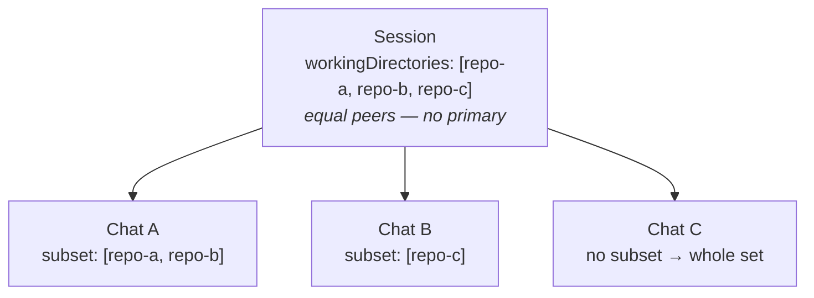
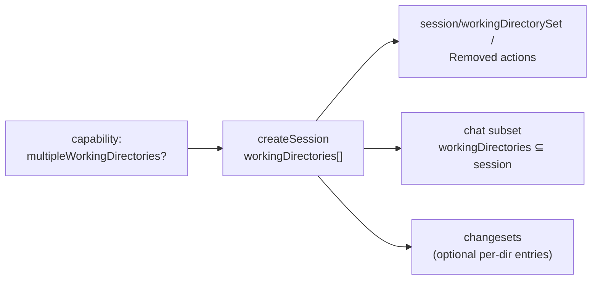
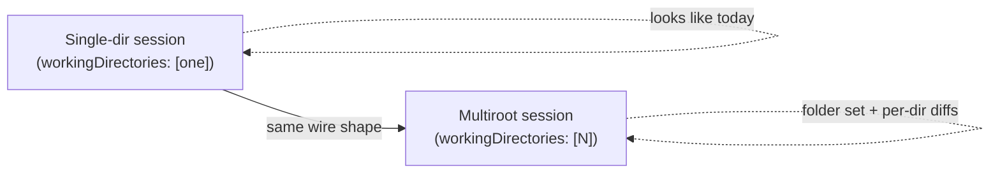

# Multiroot 工作階段 — 功能概述

> 用於演示的 multiroot-工作階段功能的概念演練
> 和設計討論，加上具體協定表面的簡明圖，以便
> 審閱者可以將框架與實際的 `types/` 變更連結起來。就像
> [多聊天概述](./multi-chat.md)，它解釋了**什麼**功能
> 以及**為什麼**它在達到線形之前就存在。

---

## 1. 問題

如今，代理程式工作階段的範圍僅限於**單一工作目錄**。工作階段
`workingDirectory` 是代理程式具有工具存取權限的唯一根目錄 - 它的資料夾
讀取、編輯、運行命令和比較。

該模型與實際任務越來越不一致。日常工作跨越**更多
一次不只一個目錄**：

- 對服務*和*它所依賴的共享庫的更改，在兄弟中
  儲存庫。
- monorepo 任務涉及使用者單獨儲存的兩個包
  結帳。
- 一起編輯來源儲存庫及其產生的-用戶端儲存庫的遷移。
- VS Code **多根工作區** (`.code-workspace`)，其資料夾為
  使用者，一個專案。

當工作階段只能看到一個目錄時，使用者被迫要麼
將與實際工作方式不符的所有內容壓平在一個根下，或者
對缺少共享上下文的每個資料夾執行**斷開連線工作階段**（相同
任務、相同的對話、相同的配置）。

**一句話概括的功能：**讓單一工作階段授予其代理工具
存取*多個工作目錄*——平等，無特權
「主要」—以便跨目錄工作可以作為一個整體來表示和驅動
連貫的整體。

---

## 2.心智模型

三個角色，巢狀：

- **A 工作階段擁有一組*工作目錄。 **它們是**平等的同行** —
  沒有“主要”，也沒有“附加”。工作階段是邊界
  代理可以觸摸：集合中的每個目錄都是公平的遊戲，外面沒有任何內容
  是的。

- **聊天在工作階段目錄的*子集*中進行。 **
  工作執行緒通常集中於工作階段的一部分。聊天可能會將其固定到
  一個目錄（或幾個）；當它沒有固定任何東西時，它會看到工作階段的整個
  設定。

- **變更未鎖定到目錄。 **更改集（例如“最後一回合”）可能會
  跨越多個工作目錄。用戶端需要每個目錄的視圖群組
  變更集的檔案本身與工作階段的目錄清單相對應；一個主機
  可以額外公開專用的每個目錄變更集作為額外目錄
  條目。

> 一工作階段，許多相同的目錄。每個聊天都會縮小到一個子集。變化
> 可以跨目錄；分組是可選的。





一個有用的類比：工作階段是一個 **VS Code 多根工作區**，它的
目錄是**工作區資料夾**，聊天是可能關心的**任務**
僅涉及其中一些資料夾。

---

## 3. 該功能在堆疊中的位置

與多聊天一樣，此功能是了解安全帶功能的**視窗**，而不是
機製本身。


```
   ┌─────────────┐                         ┌──────────────────────────────┐
   │  UI client  │   ◄── feature layer ──► │   Agent harness              │
   │ (the app a  │  directory set, per-    │   ── grants the agent tool   │
   │  user sees) │  chat subset, per-dir   │      access to N directories │
   └─────────────┘  changesets             │   ── roots the process /     │
                                           │      applies path grants     │
                                           └──────────────────────────────┘
```


- **線束層**是目錄存取實際生效的地方：生根
  代理行程，應用檔案系統路徑授權，隔離工作樹。怎樣一個
  後端強制執行「代理可以接觸這三個資料夾」是它自己的事。

- **功能/互通性層**（此功能所在的位置）讓 UI
  *宣告並觀察*該集合 - 在建立工作階段時選擇目錄，
  稍後新增/刪除它們，將聊天範圍縮小到子集，並呈現按以下分組的更改
  目錄。

**該功能是關於表示和控制，而不是存取強制。 **
為用戶端提供「此工作階段適用於這些資料夾」的詞彙表；的
線束決定如何實作。

---

## 4. 該功能為您提供了什麼

在特徵層面，多根工作階段引入了一個小的、可加的集合
能力：

1. **能力門。 ** 代理通告它是否支援多個
   工作目錄。用戶端在提供任何多根可供性之前檢查它；
   不支援它的代理的行為與今天完全相同。

2. **工作階段目錄集。 ** 工作階段是使用工作*清單*建立的
   目錄，所有對等體都是平等的。單一目錄工作階段只是以下列表
   長度一.

3. **啟動後新增/刪除。 ** 目錄可以在啟動時授予或撤銷
   工作階段運行。刪除被建模為「重新配置到這個減少的集合」—那裡
   下面並不存在脆弱的單一刪除原語。

4. **每個聊天的子集。 ** 每個聊天可能會縮小到工作階段的子集
   目錄（每個條目必須是工作階段之一）。聊天範圍縮小
   沒有任何東西可以對抗整個集合。

5. **可選的每個目錄變更視圖。 ** 更改集是跨領域的（a
   每回合變更集跨越代理觸及的每個目錄）。一用戶端
   想要每個目錄視圖將變更集的檔案本身與
   工作階段的目錄清單；主機也可以公開專用的每個目錄
   變更集作為額外的目錄條目。沒有什麼會強制使用單目錄範圍。





---

## 5. 工作範例：跨儲存庫更改

使用者要求代理程式更新 API 和使用它的用戶端函式庫，
保留為兩個單獨的結帳處。

|使用者/安全帶做什麼 |該功能如何表示它 |
| --- | --- |
|使用者透過 `api/` 和 `client/` 啟動任務 |帶有 `workingDirectories: [api, client]` 的工作階段。 |
|代理編輯兩個儲存庫 |代理具有對兩個目錄的工具存取權限，對等體。 |
|使用者僅在用戶端 | 上開啟一個焦點執行緒。固定在 `workingDirectories: [client]` 的聊天。 |
|代理程式稍後也需要共用的 `protos/` 儲存庫 |調度 `session/workingDirectorySet(protos)` → 設定變成 `[api, client, protos]`。 |
|使用者評論差異 | 工作階段的變更集列出了目錄中每個已更改的檔案；如果需要，用戶端按目錄將它們分組以供顯示。 |
| `protos/` 工作結果是不必要的 |調度 `session/workingDirectoryRemoved(protos)` → 設定重新配置回 `[api, client]`。 |

工作階段保持一個連貫的對話和一個共享的配置
自始至終－沒有雜耍三個斷開連線的工作階段。

---

## 6. 這個特性*不*是有意為之的

- **這不是權限/沙箱模型。 ** 目錄集顯示 *which
  工作階段工作的資料夾*，而不是代理可能的細粒度 ACL
  讀與寫。執行和最低權限政策仍然是一個值得關注的問題。

- **它不是每個檔案或每個 glob 範圍。 ** 該單元是一個工作目錄（一個
  root），而不是其中的任意路徑模式。

- **沒有強制小學；當需要時，它是針對每個聊天的。 ** 所有目錄都是
  預設情況下，**工作階段根本沒有主節點**。一個後端
  *需要*一個傑出的根通告`requiresPrimary`；那麼用戶端
  透過 `primaryWorkingDirectory` 在每次 **聊天** 中明確指定它（在
  `createChat` 或 `createSession` 以播種預設聊天）。它是唯讀的
  並固定在聊天建立時－從不從陣列位置推斷，從不變異
  出生後。

- **它不是多根*聊天作為子工作階段*。 **聊天縮小到一個子集
  仍然是一個處於工作階段信任和身份之下的執行緒。獨立代理
  具有自己的生命週期仍然是獨立的、未來的子工作階段概念。

這些省略使該功能保持較小且可組合。更豐富的路徑政策，
每個工具的範圍或工作空間層級的配置是自然的「未來」軸，可以
分層而不破壞這個形狀。

---

## 7. 為什麼是這個形狀

- **平等，沒有主要。 ** 使用者的心智模式（「這些資料夾是我的
  項目”）沒有特權根。對primary進行編碼會造成混亂
  「小學和中學是什麼關係？」沒有好處的問題
  答案——所以模型拒絕它。

- **工作階段擁有聊天子集。 ** 最廣泛的範圍位於共享的地方
  （工作階段）；聊天只會“縮小”，而不會擴大。這保持了
  不變的簡單：聊天的目錄總是 ⊆ 工作階段的。

- **變更集保持交叉。 ** 變更集不綁定到一個目錄 —
  每回合差異可以跨越多個 - 因此沒有目錄欄位被強加到它上面。
  每個目錄的呈現是可選的：用戶端將變更集的檔案分組
  針對已知目錄列表，或主機通告額外的每個目錄
  目錄條目。兩者都重複使用現有的形狀；兩者都不需要陣列的陣列。

- **附加和能力門控。 **每個新欄位都是可選的；命令
  被門控在功能加上版本握手之後。單一目錄
  安全帶未受影響；多根線束只是點亮更多目錄。





---

## 8. 協定介面（供審閱者使用）

支援上述框架的具體的、附加的變更－審稿人的地圖
`types/`表面。完整的散文細節存在於
[狀態模型](/guide/state-model#multiroot-sessions) 和
[變更集](/guide/changesets) 指南。目標規格版本：**0.7.0**。

這裡的一切都是**附加的和可選的**——沒有欄位是必填的，沒有現有的
欄位變更型別，而忽略新表面的舊用戶端表現完全相同
就像今天一樣。

### 8.1 更改表

|符號|文件|親切 |
| --- | --- | --- |
| `AgentCapabilities.multipleWorkingDirectories?` | `channels-root/state.ts` |新增（功能）|
| `MultipleWorkingDirectoriesCapability`（`requiresPrimary?`）| `channels-root/state.ts` |新增 (型別) |
| `CreateSessionParams.workingDirectories?` / `primaryWorkingDirectory?` | `channels-session/commands.ts` |新增 |
| `SessionMetadata.workingDirectories?`（→ `SessionState`，`SessionSummary`）| `channels-session/state.ts` |新增 |
| `session/workingDirectorySet` / `session/workingDirectoryRemoved` 操作 | `channels-session/actions.ts` |新增（操作）|
| `ChatState.workingDirectories?` / `primaryWorkingDirectory?` （和 `ChatSummary`）| `channels-chat/state.ts` |新增 |
| `CreateChatParams.workingDirectories?` / `primaryWorkingDirectory?` | `channels-chat/commands.ts` |新增 |
| `chat/workingDirectorySet` / `chat/workingDirectoryRemoved` 操作 | `channels-chat/actions.ts` |新增（操作）|
| 4 `ActionType` 條目 + `ACTION_INTRODUCED_IN` (`0.7.0`) | `common/actions.ts`，`version/registry.ts` |新增 |

> **審查後修訂。 ** 目錄突變表面最初為 4
> **指令** (`add/removeWorkspaceFolder`, `add/removeChatWorkspaceFolder`
> 帶有請求/結果類型）。根據審核，現在有四個 **狀態操作**
> 遵循鍵控集合約定 - 該集合位於狀態中，因此用戶端
> 透過調度動作來改變它並觀察結果
> `workingDirectories`。已棄用的單數 `workingDirectory` 欄位是
> **硬刪除**（重大變更 → 0.7.0），不保留為簡寫。安
> 早期版本還在群組中新增了一個 `Changeset.workingDirectory` 欄位
> 每個目錄的變更；已被**刪除**－變更集可以跨越
> 目錄（例如每輪差異），因此單目錄標量是錯誤的
> 模型。每個目錄的呈現由可選的用戶端端處理
> 分組或額外的每個目錄目錄條目（參見§6/§7）。

### 8.2 型別簽名


```ts
// ── Capability — channels-root/state.ts ──────────────────────────────────
interface AgentCapabilities {
  // …existing…
  /** Presence ({}) = the agent supports >1 working directory per session. */
  multipleWorkingDirectories?: MultipleWorkingDirectoriesCapability;
}
interface MultipleWorkingDirectoriesCapability {
  /** The agent needs one directory designated as its primary root. */
  requiresPrimary?: boolean;
}

// ── Session create — channels-session/commands.ts ────────────────────────
interface CreateSessionParams extends BaseParams {
  // …existing…
  /** The session's equal-peer working directories. */
  workingDirectories?: URI[];
  /** Seeds the default chat's primary (⊆ workingDirectories); when requiresPrimary. */
  primaryWorkingDirectory?: URI;
}

// ── Session state — channels-session/state.ts (→ SessionState/SessionSummary)
interface SessionMetadata {
  // …existing…
  workingDirectories?: URI[];   // equal peers; the session has NO primary
}

// ── Session runtime mutation — channels-session/actions.ts ────────────────
// channel = session URI. Gated by multipleWorkingDirectories. @clientDispatchable.
interface SessionWorkingDirectorySetAction {
  type: ActionType.SessionWorkingDirectorySet;     // 'session/workingDirectorySet'
  directory: URI;                                   // appended; no-op if present
}
interface SessionWorkingDirectoryRemovedAction {
  type: ActionType.SessionWorkingDirectoryRemoved; // 'session/workingDirectoryRemoved'
  directory: URI;                                   // removed; no-op if absent
}

// ── Chat — channels-chat/state.ts, commands.ts & actions.ts ──────────────
interface ChatState /* and ChatSummary */ {
  // …existing…
  /** The chat's subset — every entry MUST be one of the session's dirs. */
  workingDirectories?: URI[];
  /** Read-only, fixed at creation; no action, not in chatUpdated. */
  primaryWorkingDirectory?: URI;
}
interface CreateChatParams extends BaseParams {
  // …existing…
  workingDirectories?: URI[]; // subset ⊆ session; absent → whole session set
  primaryWorkingDirectory?: URI; // ⊆ chat's dirs; when requiresPrimary
}
// channel = chat URI. Gated by multipleWorkingDirectories. @clientDispatchable.
interface ChatWorkingDirectorySetAction {
  type: ActionType.ChatWorkingDirectorySet;     // 'chat/workingDirectorySet'
  directory: URI;                                // MUST be in the session set
}
interface ChatWorkingDirectoryRemovedAction {
  type: ActionType.ChatWorkingDirectoryRemoved; // 'chat/workingDirectoryRemoved'
  directory: URI;
}

// ── Changes — channels-changeset/state.ts ────────────────────────────────
// No changes. A changeset can span working directories, so it carries no
// directory field. Per-directory views are optional: clients group a
// changeset's files against the session's workingDirectories, or a host
// advertises extra per-directory catalogue entries.
```


### 8.3 版本控制與門控

- `PROTOCOL_VERSION` 是 **`0.7.0`** — 一個輕微的變化，因為該功能是
  破壞（它刪除了在
  發布了 `0.6.0`)，並且 1.0 之前的重大更改出現在 MINOR 中。
  `SUPPORTED_PROTOCOL_VERSIONS` = `[0.7.0, 0.6.0, 0.5.2, 0.5.1]`。
- 四個目錄突變是 **狀態操作**，因此它們攜帶
  `ACTION_INTRODUCED_IN` 條目位於 `0.7.0`（且是 `@clientDispatchable`）。
  其他一切——功能和建立時/狀態欄位——都是門控的
  由 `multipleWorkingDirectories` 功能加上 `initialize` 版本
  握手。
- 刪除操作是冪等的，建模為
  *重新配置到縮減集*；主機可以拒絕應用程式刪除（例如
  仍指定為某些聊天的主要目錄），離開該集合
  不變。

---

## 9. 設計決策與已解決的問題

- **主要是每個聊天，只讀，在建立時固定。 ** *已解決：* 該集合是
  預設是平等的，**工作階段沒有主**。拒絕了
  「主要+附加」分割，因為它重新給使用者帶來了困惑
  喊出（「初級和次級之間的關係是什麼？」）。代理商
  需要一個顯著的根來通告 `requiresPrimary`；用戶端
  透過 `primaryWorkingDirectory` **每次聊天**指定它
  （`createChat` 或 `createSession` 播種預設聊天）。已儲存
  `ChatState`/`ChatSummary` 上唯讀（使用者可見，可在後期恢復）
  訂閱者），但**沒有變異行為**且不屬於
  `session/chatUpdated` - 所以它是可見的但不可變的。「在狀態」和
  「mutable」在 AHP 中是正交的：可變性來自現有的操作，而不是
  來自價值存在的地方。故意*不*位置－從未推斷
  來自陣列索引 - 並且條目上的角色形狀被拒絕，因為它會將不可變主項與可變集的生命週期結合。

- **硬刪除單數 `workingDirectory`。 ** *已解決（根據評論）：*
  刪除這些欄位是一項重大更改，因此該功能的目標是次要
  凹凸（`0.7.0`）；已棄用的奇異欄位
  `CreateSessionParams` / `SessionMetadata` / `ChatState` / `ChatSummary` 是
  直接刪除而不是作為速記保留。（原本計劃騎
  `0.6.0` 的破壞視窗，但 `0.6.0` 出廠時沒有此功能。）

- **目錄突變是狀態操作，而不是指令。 ** *已解決（根據
  評論）：* `workingDirectories` 是一個帶有鍵的集合，因此它遵循
  已建立的 `*/workingDirectorySet` + `*/workingDirectoryRemoved` 操作
  約定（工作階段和聊天）與純 reducer，而不是
  請求/回應命令。該集合位於狀態；用戶端觀察值結果
  那裡。

- **聊天縮小到一個子集（不完全是一個）。 ** *已解決：*早期草稿
  使聊天只在一個目錄中運行；這被擴展為“子集 ⊆
  工作階段的集合”，缺席意味著整個集合。由相同的門控
  能力。

- **變更集上沒有目錄欄位。 ** *已解決（根據審查）：* 較早的
  修訂版在變更集上放置了一個 `Changeset.workingDirectory` 標量並進行了修改
  多根主機必須按目錄分組。已刪除 - 變更集可以跨越
  目錄（每輪差異涉及多個目錄），因此單目錄標量
  無法對常見情況進行建模，審閱者指出將文件與
  目錄是針對已知目錄清單的簡單用戶端端操作
  （不是 VCS 邊界問題）。因此，每個目錄的呈現方式是
  可選：用戶端將變更集的檔案本身分組，且主機可以公開
  額外的每個目錄目錄條目（已經可能 - `changesets`
  列表是無限的）。機器可讀的每個目錄關聯（例如
  `{workingDirectory}` 模板變數）將在需要時延遲到後續操作。

- **刪除語意。 ** *已解決：* 不假定單一刪除原語；的
  `*/workingDirectoryRemoved` 操作減少到減少集，所以它是
  冪等且可以安全重試。主機可能會拒絕（例如目錄仍然
  指定為某些聊天的主要物件）。

---

## 10. 開放性問題/未來軸

- **配置解析上下文。 ** `resolveSessionConfig` /
  `sessionConfigCompletions` 仍然採用*單數* `workingDirectory` 作為
  用於解析配置的上下文（例如列出工作樹選擇器的 git 分支）。
  是否以及如何使配置解析具有多根意識仍是一個問題
  後續行動。

- **輕量級摘要上的每個目錄總結。 ** `ChangesSummary` 是
  今天單一聚合。如果工作階段-list UI 想要每個儲存庫徽章而不需要
  訂閱後，可以稍後新增 `byDirectory` 匯總 — 推遲以保留
  總結輕量級。

- **更豐富的路徑策略。 ** 每個工具範圍、每個目錄的讀與寫，或
  全域層級的規則故意超出範圍，並且可以分層在頂部。

---

## 11. 一張投影片摘要

- **之前：** 工作階段的範圍為 `workingDirectory`。
- **之後：** 工作階段擁有一組**對等目錄**； **聊天**有效
  在**子集中**； **變更集可以跨目錄**（分組是可選的）。
- **為什麼：** 跨目錄/多儲存庫/多根工作空間任務是其中之一
  連貫的作品，而不是 N 個不連貫的工作階段。
- **如何保持安全：** 能力閘控、附加欄位；目錄突變
  是冪等的用戶端-可調度操作；刪除是重新配置到減少集。
- **它不是什麼：**不是權限模型，不是每個檔案的範圍，不是
  強制性的主要軸，而不是子工作階段 - 這些是單獨的/未來的軸。