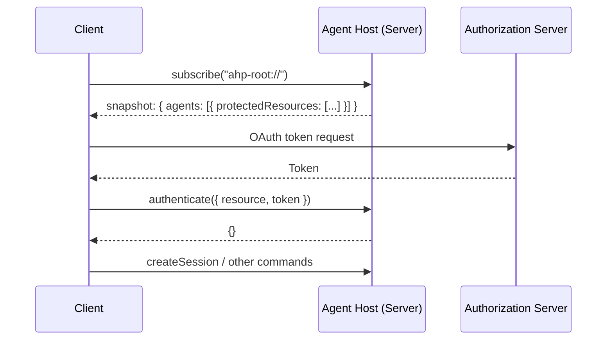

# 驗證

AHP 使用 [RFC 9728](https://datatracker.ietf.org/doc/html/rfc9728)（OAuth 2.0 受保護資源元資料）語意進行驗證發現，並使用 [RFC 6750](https://datatracker.ietf.org/doc/html/rfc6750)（承載代幣使用）語意進行令牌傳遞。通訊是 JSON-RPC，而不是 HTTP，但詞彙和流程反映了 HTTP 標準。

## 概述

每個代理程式都宣告需要透過根狀態中 [`AgentInfo`](/reference/root#agentinfo) 上的 `protectedResources` 欄位進行驗證的 **受保護資源**。用戶端透過訂閱 `ahp-root://` 來發現這些要求，使用標準 OAuth 2.0 流程從宣告的授權伺服器取得令牌，並透過 [`authenticate`](/reference/common#authenticate) 指令將它們推送到伺服器。





## 發現

驗證要求在 [`AgentInfo.protectedResources`](/reference/root#agentinfo) 上宣告**每個代理**。每個條目都是遵循 [RFC 9728](https://datatracker.ietf.org/doc/html/rfc9728) 形狀的 [`ProtectedResourceMetadata`](/reference/common#protectedresourcemetadata) 物件：


```json
{
  "agents": [
    {
      "provider": "copilot",
      "displayName": "GitHub Copilot",
      "description": "AI pair programmer",
      "models": [...],
      "protectedResources": [
        {
          "resource": "https://api.github.com",
          "resource_name": "GitHub Copilot",
          "authorization_servers": ["https://github.com/login/oauth"],
          "scopes_supported": ["read:user", "user:email"]
        }
      ]
    }
  ]
}
```


用戶端透過根狀態快照（訂閱 `ahp-root://` 時）以及在代理程式清單變更時透過 `root/agentsChanged` 操作自動接收此元資料。

沒有 `protectedResources`（或空陣列）的代理不需要身份驗證。

### 必需的與可選的身份驗證

每個受保護的資源條目都有一個 `required` 欄位（預設為 `true`），用於控制是否可以在沒有令牌的情況下使用代理：

- **`required: true`**（預設）— 代理程式在沒有驗證的情況下無法運作。如果用戶端嘗試使用未經驗證的代理，則伺服器應傳回 `AuthRequired` (`-32007`)。
- **`required: false`** — 代理程式無需身份驗證即可運作，但在提供令牌時可以提供增強的功能（例如更高的速率限制、個人化結果）。

用戶端應將缺少的 `required` 欄位視為與 `true` 相同。


```json
{
  "protectedResources": [
    {
      "resource": "https://api.example.com",
      "resource_name": "Example API",
      "authorization_servers": ["https://login.example.com"],
      "required": false
    }
  ]
}
```


用戶端可以使用 `required` 欄位來決定是否預先提示使用者進行身份驗證或延遲身份驗證，直到使用者明確要求受益於身份驗證的功能。

### 為什麼每個代理元資料？

不同的代理可能需要不同提供者的身份驗證。例如，一個代理程式可能需要 GitHub 令牌，而另一個代理程式可能需要 Azure AD 令牌。聲明每個代理程式的要求而不是在伺服器範圍內允許：

- 單一伺服器用於託管來自具有不同驗證要求的不同提供者的代理
- 用戶端選擇性地僅對他們打算使用的代理進行身份驗證
- 授權要求隨著代理程式的新增或刪除而改變

## 代幣交付

用戶端使用 [`authenticate`](/reference/common#authenticate) 指令將承載代幣推送到伺服器。 `resource` 欄位必須與伺服器本身通告的 `resource` 值相符 - 可以透過代理程式的 `protectedResources` 元資料靜態地進行，也可以透過即時的 MCP 驗證質詢動態地進行（`McpServerAuthRequiredState.resource` 或對於單一被封鎖的工具呼叫，`ToolCallAuthRequiredState.auth.resource` -{x07）


```jsonc
// Client → Server
{
  "jsonrpc": "2.0",
  "id": 3,
  "method": "authenticate",
  "params": {
    "channel": "ahp-root://",
    "resource": "https://api.github.com",
    "token": "gho_xxxxxxxxxxxx",
    "scopes": ["read:user", "user:email"]
  }
}

// Server → Client (success)
{
  "jsonrpc": "2.0",
  "id": 3,
  "result": {}
}
```


`scopes` 是可選的，讓用戶端告訴伺服器推送的令牌實際授予哪些 OAuth 範圍 - 在解決 `requiredScopes` 質詢（來自實時 `McpServerAuthRequiredState` 或 `ToolCallAuthRequiredState.auth`）時非常有用，而伺服器不需要解碼不透明令牌。

如果令牌無效或資源無法識別，則伺服器必須傳回 JSON-RPC 錯誤（例如 `AuthRequired` `-32007` 或 `InvalidParams` `-32602`）。

### 為什麼用 `resource` 鍵控？

RFC 9728 `resource` 欄位已經是受保護資源的唯一識別碼。直接使用它作為發現和令牌傳遞之間的關聯鍵可以避免發明並行 ID 方案。用戶端使用標準 OAuth 2.0 語意將令牌與資源配對。

## 錯誤處理

### `AuthRequired` 錯誤代碼

當指令因用戶端尚未對所需的受保護資源進行驗證而失敗時，伺服器應傳回錯誤代碼 `-32007` (`AuthRequired`)。此錯誤可能從 **任何** 命令傳回 - 不僅僅是 `authenticate`。

JSON-RPC 錯誤的 `data` 欄位必須是描述需要驗證的資源的 `AuthRequiredErrorData` 物件 (`{ resources: ProtectedResourceMetadata[] }`)。這允許用戶端以程式方式處理身份驗證：


```jsonc
// Client → Server
{
  "jsonrpc": "2.0",
  "id": 5,
  "method": "createSession",
  "params": { "channel": "ahp-session:/<uuid>", "provider": "copilot" }
}

// Server → Client (auth required)
{
  "jsonrpc": "2.0",
  "id": 5,
  "error": {
    "code": -32007,
    "message": "Authentication required for GitHub Copilot",
    "data": {
      "resources": [
        {
          "resource": "https://api.github.com",
          "resource_name": "GitHub Copilot",
          "authorization_servers": ["https://github.com/login/oauth"],
          "scopes_supported": ["read:user", "user:email"]
        }
      ]
    }
  }
}
```


用戶端收到 `AuthRequired` 錯誤應該：

1、解析`data`欄位，發現所需的資源
2.從聲明的授權伺服器中取得token
3. 透過`authenticate`推送代幣
4. 重試原來的命令

## 授權到期通知

當先前有效的令牌過期或被撤銷，或出現新的驗證要求時，伺服器可以發送 [`auth/required`](/reference/common#authrequired) 通知：


```json
{
  "jsonrpc": "2.0",
  "method": "auth/required",
  "params": {
    "channel": "ahp-root://",
    "resource": "https://api.github.com",
    "reason": "expired"
  }
}
```


`reason` 欄位指示為什麼需要身份驗證：

|價值|描述 |
|---|---|
| `required` | 用戶端尚未對資源進行驗證 |
| `expired` |先前有效的令牌已過期或被撤銷 |

與所有協定通知一樣，`auth/required` 是短暫的，並且在重新連線時**不會**重播。用戶端重新連線後應重新檢查驗證要求。

## 設計決策

### 為什麼使用 RFC 9728 而不是自訂型別？

使用標準 OAuth 2.0 受保護資源元資料格式表示：

- 用戶端可以使用與其他基於 OAuth 的協定相同的程式碼路徑解析令牌（例如 MCP）
- 動態身分驗證提供者（針對企業 IdP）無需特定供應商的硬編碼知識即可運作
- `authorization_servers` 欄位可在支援它的執行時間中啟用自動提供者匹配

### 為什麼 `authenticate` 而不是在 `initialize` 中包含令牌？

- 身份驗證是針對每個資源的，而不是針對每個連線的
- 用戶端可以獨立驗證多個資源
- 無需重新初始化連線即可刷新或輪換令牌
- 並非所有用戶端都需要進行驗證（某些代理程式可能不需要驗證）

### 為什麼不在 root 狀態中儲存身份驗證狀態？

根狀態是全域的，並且對所有訂閱的用戶端可見。身份驗證狀態是針對每個連線的（每個用戶端獨立進行身份驗證），因此透過命令和通知保持命令狀態，而不是污染共享的狀態樹。