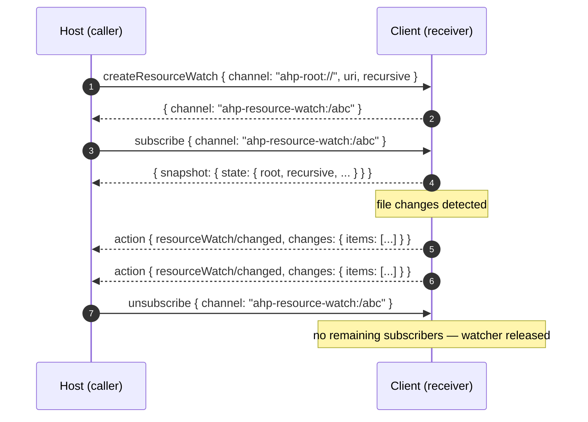

# 資源觀看通道

資源監視通道為單一 URI 子樹傳遞檔案系統變更事件。監視是短暫的且針對每個連線 - 它們的存在純粹是為了在至少一個訂閱者連線時將 `resourceWatch/changed` 操作推送回呼叫者。

手錶位於 `resourceRead`、`resourceWrite` 和朋友使用的同一個雙向 `resource*` 系列之上。任一對等方都可以啟動監視：主機使用它來觀察用戶端發布的 `virtual://...` 資源（或每個工作階段檔案系統提供者），而用戶端使用它來觀察主機端檔案。

## 網址


```
ahp-resource-watch:/<id>
```


該 ID 是**接收者指派的**。接收方為每個成功的 [`createResourceWatch`](/reference/common) 呼叫分配一個新的監視通道 URI，並在 `CreateResourceWatchResult.channel` 上傳回它；呼叫者必須將 URI 視為不透明。

## 狀態

訂閱者會收到一個 [`ResourceWatchState`](/reference/common) 快照，描述正在觀看的內容：


```typescript
ResourceWatchState {
  root: URI
  recursive: boolean
  excludes?: { items: string[] }
  includes?: { items: string[] }
}
```


狀態在手錶的生命週期中永遠不會發生變化 - 它在 `createResourceWatch` 時間捕獲並在每個 `subscribe` 和 `reconnect` 上逐字傳回。更改事件流經操作流程（見下文），而不是透過狀態突變。

## 生命週期

1. **開啟** — 呼叫者在 `ahp-root://` 上發送 [`createResourceWatch`](/reference/common)，其中包含要觀看的根 URI 和任何 `recursive`/`includes`/`excludes` 過濾器。接收方分配一個 `ahp-resource-watch:/<id>` URI 並回傳它。
2. **訂閱** — 呼叫者 [`subscribe`](/specification/subscriptions#subscribe-request) 存取該通道 URI 以開始接收 `resourceWatch/changed` 操作。 `subscribe` 傳回的快照包含監視描述符。
3. **接收事件** — 只要 `root` 下的檔案發生更改，接收器就會調度 `resourceWatch/changed` 操作。事件是批次的：每個操作都帶有 `changes.items[]`。
4. **關閉** — 來自通道的呼叫者 [`unsubscribe`](/specification/subscriptions#unsubscribe-notification)。沒有明確的 dispose 命令：一旦每個連線上的每個訂閱者都取消訂閱（或這些連線已中斷），接收者必須釋放底層觀察者。





## 行動

此通道只發出一個動作：

|行動|方向 |意義|
|---|---|---|
| `resourceWatch/changed` |接收者 → 呼叫者 |一批 `ResourceChange` 條目。每個條目都有一個 `uri` 和一個 `'added'`、`'updated'` 或 `'deleted'` 的 `type`。 |

訂閱者直接從營運流程消費 `resourceWatch/changed` - reducer 不保留歷史記錄。

## 允許

接收者必須透過與 `resource*` 系列其餘成員相同的權限流來控制 `createResourceWatch`。如果存取被拒絕，則傳回 `PermissionDenied` (`-32009`)，其中包含描述所需存取的 `resourceRequest` 負載（請參閱 [`resourceRequest`](/reference/common)）。

## 該通道上的方法和事件

### 指令

|方法|通道|為什麼 |
|---|---|---|
| `createResourceWatch` | `ahp-root://` |連線級指令，用於開啟觀察器並傳回通道 URI。對稱：用戶端 → 伺服器 **或** 伺服器 → 用戶端。 |
| `subscribe` / `unsubscribe` | `ahp-resource-watch:/<id>` |標準訂閱生命週期。取消訂閱最後一個訂閱者會釋放觀察者。 |

### 行動

|行動|方向 |
|---|---|
| `resourceWatch/changed` |接收者 → 來電者（透過標準 `action` 信封）|